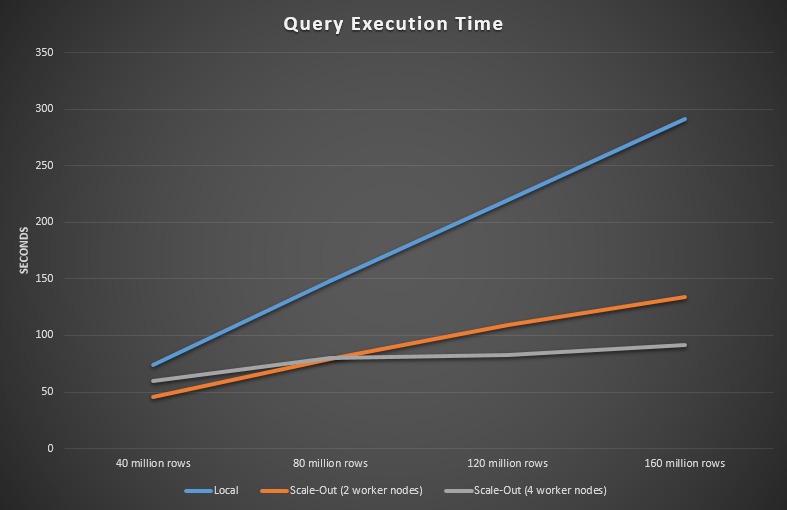
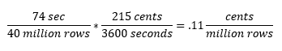
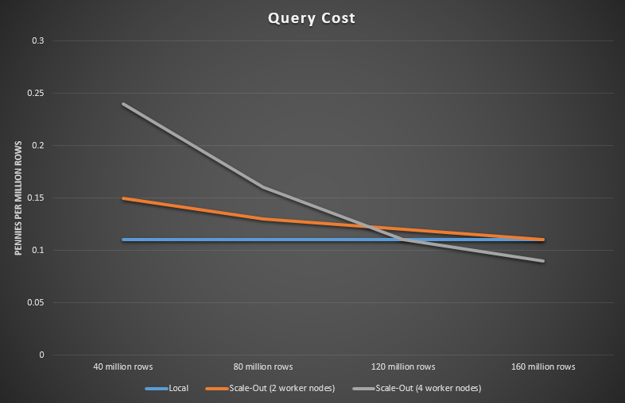

# Data Virtualization Techniques Using SQL Server 2016 and HDInsight: Performance Benchmarks and Costing

Query Scale-out makes sense if the data already exists on HDInsight. You may not want to push all the data to HDInsight just to see the performance gain. However, one can imagine the use case where lots of processing happens in HDInsight that can be joined back to SQL Server. To give you a rough idea of what sort of performance gains you can expect, here are some benchmark numbers based on the large BigProduct table used in the [solution demo](https://gallery.cortanaintelligence.com/Tutorial/Data-Virtualization-Techniques-Using-SQL-Server-2016-and-HDInsight) (varying the size of data and the number of worker nodes):

Note the linear increase in execution time with SQL Server only versus when HDInsight is used as well.

Another interesting observation is the flattening out of execution time of a four versus a two-worker node HDInsight cluster.

Naturally these results are specific to the simplified dataset and schema we are providing with the solution demo and real world datasets would be much larger and the SQL Server would be a shared resource potentially running multiple queries competing for resources.

The next question to ask is when it becomes cost effective to switch over from not using scale out to using scale out. Let's do the math to incorporate the performance data from above with the resource costs.

Using the [Azure pricing calculator](https://azure.microsoft.com/en-us/pricing/calculator/), you can estimate the cost of the resources used in this tutorial:

- A virtual machine of size Standard DS12 v2 of type SQL Server with a SQL Enterprise license using the standard pricing tier in East US costs **$2.152/hour**.
- An HDInsight Spark cluster with 2 head and 2 worker Standard D3 v2 nodes of type Windows using the standard pricing tier in East US costs **$2.48/hour**.
- An HDInsight Spark cluster with 2 head and 4 worker Standard D3 v2 nodes of type Windows using the standard pricing tier in East US costs **$3.72/hour**.

So, the cost without scaling out (just using the VM with SQL Server 2016) is **$2.152/hour**. The cost with scaling out to a 2 node HDInsight cluster is $2.152/hour + $2.48/hour = **$4.63/hour**. The cost with scaling out to a 4 node HDInsight cluster is $2.152/hour + $3.72/hour = **$5.87/hour**. Note that these numbers are roughly right, but they don't consider the significantly cheaper resource costs of the public IP address, network interface, storage account, and load balancer.

Let's do the math to incorporate the performance data from above with the resource costs.

The raw performance data is:

| Type | 40 million rows | 80 million rows | 120 million rows | 160 million rows |
| ---- | --------------- | --------------- | ---------------- | ---------------- |
| no scale out (SQL Server only) | 74 sec | 148 sec | 220 sec | 291 sec |
| scale out (SQL Server + 2 node HDInsight cluster) | 46 sec | 79 sec | 109 sec | 134 sec |
| scale out (SQL Server + 4 node HDInsight cluster) | 60 sec | 80 sec | 83 sec | 92 sec |

Now, for each cell, divide the seconds by the number of million rows, then multiply by the cost (in cents) divided by the time (in seconds). For example, for the first cell we would do:

which means that it costs .11 cents per million rows to process 40 million rows when not scaling out (just using SQL Server).

We do this for each cell and get:

| Type | 40 million rows | 80 million rows | 120 million rows | 160 million rows |
| --- | --- | --- | --- | --- |
| no scale out (SQL Server only) | 0.11 | 0.11 | 0.11 | 0.11 |
| scale out (SQL Server + 2 node HDInsight cluster) | 0.15 | 0.13 | 0.12 | 0.11 |
| scale out (SQL Server + 4 node HDInsight cluster) | 0.24 | 0.16 | 0.11 | 0.9 |

At this point if we graph these data it looks like:

You can see that with 40 million rows it is cheapest to run without scaling out, and by the time you have 160 million rows scaling out becomes cheaper. This shows that as the number of rows increases, it would become cheaper to run with scaling out . You can use these types of benchmarks and calculations to help you deploy resources with the proper balance of performance and cost.
