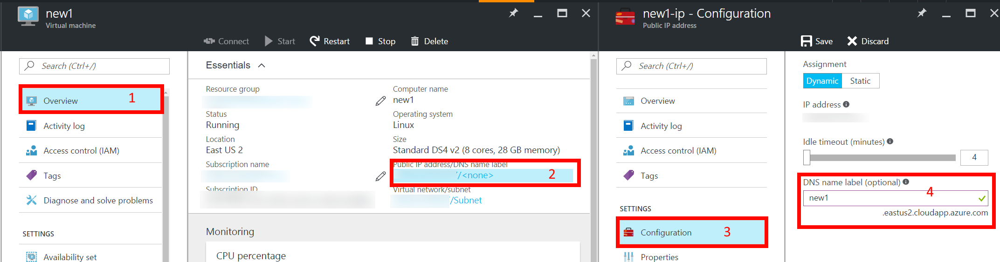
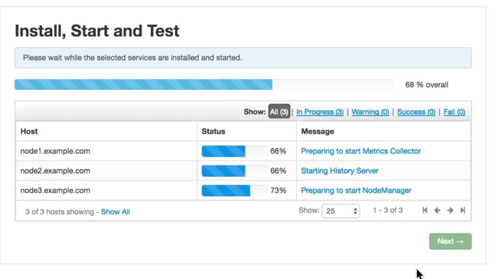

## Deploying a HDP 2.4 MultiNode HortonWorks Hadoop Cluster with Ambari on Azure

This tutorial walks through setting up a three node HortonWorks HDP 2.4 cluster using Azure virtual machines
found on the marketplace.  

> IMPORTANT NOTE:   
> This is adapted from HortonWorks instruction video on [HDP 2.4 Multinode Hadoop Installation using Ambari](https://www.youtube.com/watch?v=zutXwUxmaT4)  

### Prerequisites

1. An Active [Azure](https://azure.microsoft.com/) subscription. 

### Deploy Virtual Machines
Create three machines that will serve as resource manager, yarn and two nodes. 

1. Login to [Azure Portal](https://portal.azure.com)  

1. Navigate to Azure Market Place and search for **"CentOS-based 6.7"**. 

1. Select the **Open Logic** Version: 
        

    > **IMPORTANT NOTE**
    > CentOS 6.7 is used here to match the deployment environment of the native HDP 2.4 Sandbox from HortonWorks.
 
1. Deploy virtual machine deploy using the **Resource Manager** model:  
    

1. Enter Configuration settings:  
    

1. Choose virtual machine size:  
      

1. Set network and storage settings:  
Create a new storage account and network security group. Under the network security group, create various inbound rules. Port **8080** allows access to Ambari web view (for cluster installation and adminstration).  
This is done by following the highlighted boxes in the visual below.  
      

    > IMPORTANT NOTE:  
    > It is advised to add this machine to the same virtual network as your SQL Server 2016 (IAAS). 
    > This makes accessibility and connectivity easier between nodes.   
    > Instead of creating a new storage account, you can attach your own or existing 
    storage account at this point.  
    >
    > **Please make note of your newly created Network Security Group name (highlighted box #3) as it will be reused on 
    the other two machines that will be deployed.** 
     

1. Add more **Network Security Inbound rules**:  
Follow the highlighted boxes (#5 - #8) in the imagery of step 7 above to open up more service TCP ports on the virtual machine needed by HDP.   
Other big data applications can be installed on HDP deployed VMs. On the security group, allow the following ports - 8000, 8888, 50070, 50095, 50075, 15000, 60010, 60030, 10000, 10001, 19888, 8443, 11000, 8050, 8993, 8744, 60080, 50111, 6080, 8088, 8080, 42080, 8020, 111, 8040, 4200, 21000, 9000, 
8983, 4040, 18080, 9995, 9090.   
When you are done, your final **Inbound security rules** should match the image below. 

      

1. Validate your configuration  
Make sure validation is successful before continuing.   
    

1. Create two more virtual machines following the steps above. These machines will serve as **DataNodes**. Please ensure that the VMs are part of the same
virtual network and Network Security Group names (Step 7 highlighted box #1 and highlighted box #3 respectively). You will not need to repeat the steps of opening the ports as it is already open in the NSG.

This completes our deployment.   

### Attach extra storage disks to virtual machines
The local SSD attached to the virtual machine is not big enough to process big data. 

- Follow steps below to attach an extra data disk to all three virtual machines.  
 

- Format and mount the new data disk  
    1. Go to [Azure Portal](http://portal.azure.com/)
        - Click**Virtual Machines > Choose your machine > Overview**  
        - Copy the Public IP address  
        - Open an SSH tool like Putty or mRemoteNG
    1. Ssh into the first virtual machine : `$ ssh <created_user>@<host>`

    1. The new disk for a newly created Azure virtual machine, running Ubuntu, will be **dev/sdc**.  
        -  List the mounted disks :  `$ ls /dev/sd?` 
    
    1. Change user to root : `sudo su`

    1. Mount new disk using the following options in this order :  **n, p, 1, default settings, w**
        - `$ fdisk /dev/sdc`  
        - Enter **n** to create a **new partition**    
        - Enter **p** to set disk as primary    
        - Enter **1** to set disk as 1st partition
        - Use default cylinder settings 
            - Select 1 for **First cylinder**  
            - Select default (133544) for Last cylinder
        -  Enter **w** to be able to write to disk  

    1. Set disk format `$ mkfs -t ext4 /dev/sdc1`. This will take a while.  

    1. Make directory for mount point : `$ mkdir /data`  

    1. Mount new disk at mount point `$ mount /dev/sdc1 /data`   

 - Persist new disk at reboot  
    1. Change user to root : `sudo su`  
    
    1. Open `/etc/fstab`  
    
    1. Enter this entry : `/dev/sdc1    /data    ext4    defaults    0 0`  

    1. Save and exit file 

### Create and Set the Fully Qualified Domain Name (FQDN) for the Azure VMs
On each virtual machine, we will be updating the `/etc/hosts` file. Machines in the cluster need information of the hostname to IP address mappings.  

#### Create hostname FQDN for all machines 
1. Login to [Azure Portal](https://portal.azure.com)  

1. Go to Virtual Machines and select your machine(s)  

1. Click on **Overview > Public IP address/DNS name label > Configuration** and create a **DNS name label** and **Save**. 
Please make a note of the name you provide here (for example `new1`) as it will be used in the later steps. Also copy the FQDN, for instance in the imagery below, your 
FQDN would be `new1.eastus2.cloudapp.azure.com`. 
  

1. Make a note Private IP addresses (**Virtual Machines > Machine Name > Network Interfaces**)

1. **Repeat above steps for the other two machines.**  

#### Add Hostnames on all machines  
1. Ssh into first host.  

1. Check and change the hostname on the node.  
    - Switch to root : ` sudo su` 

    - Update the hosts file 
        - Open `/etc/hosts` on machine 

        - Append the hostname to IP address mapping for all three nodes to `/etc/hosts`.   
        Assuming the private IP addresses are 10.0.0.1, 10.0.0.2 and 10.0.0.3 and machine names (during the FQDN creation step above) node1, node2, and node3
            ```
            10.0.0.1    node1    node1.eastus2.cloudapp.azure.com
            10.0.0.2    node2    node2.eastus2.cloudapp.azure.com
            10.0.0.3    node3    node3.eastus2.cloudapp.azure.com
            ```
1. Persist new hostname : `sudo hostname your_new_hostname`
1. **Repeat above steps for the other two machines.** So that all machines in the cluster can communicate with each other.  


### Shutdown Iptables on the hosts 
On each machine, shutdown iptables. We need to shutdown Iptables to allow the Hadoop daemons communicate across nodes. SELinux still offers security on the machines.  

- Check service status : `service iptables status`  
If Iptables is ON, a similar output as image below will be seen  
  

- Turn off Iptables if needed : `service iptables stop`  
  

### Ensure SELinux on the the hosts is enabled, permissive and enforced
- Check status : `$ sestatus`  

- Change the current status to `permissive` if it is `enforcing` : `$ setenforce 0` 

This prevents denied access to the Hadoop daemons and Ambari installation, but just log every access. 
 
### Restart and Update NTP Service on the hosts 
- Restart service : `/etc/init.d/ntpd restart`

- Update runlevel settings : `chkconfig ntpd on`

### Setup Passwordless SSH  
Perform steps on all nodes.
- Change root password  : ` sudo passwd root`  

    > IMPORTANT NOTE:  
    > You need to know the root password of the remote machine in order to copy over your ssh public key.  

- Create new root password. **_This allows us copy over ssh keys easily._**  

Now starting from machines #1  
- Switch to root user : `sudo su`  

- Create ssh keys accepting all default prompts : `ssh-keygen`

- Copy over public ssh key to other two nodes. For example to node `new2` : `$ ssh-copy-id root@new2`

- Repeat Passwordless ssh on machines #2 and #3 using steps above.  

### Setup Ambari Repository
Download the following repo files contained in the zip folder [here](./assets/yum_repos.zip)   
- ambari.repo
- epel.repo  
- epel-testing.repo  
- HDP.repo  
- HDP-UTILS.repo
- puppetlabs.repo  
- sandbox.repo

using an Scp software, like WinSCP, copy them over to `/etc/yum.repos.d/` on your virtual machines

### Check Java and get JDK directory 

Java is pre-installed on Azure Virtual Machines  
- Confirm Java installation and version : `java -version`

- Get Java Home directory following instructions : 
    1. Find Java bin path : `which java`  

    1. Get relative link of Java : `ls -ltr <path_returned_by_which_java>`  

    1. Copy path to symlink returned above and use it for this final step : `ls -ltr <path_to_symlink_copied>`  

    1. Save the final JDK path returned.  

Path should look like this `/usr/lib/jvm/jre-1.7.0-openjdk.x86_64/bin/java`  

Otherwise follow instructions from [Digital Ocean](https://www.digitalocean.com/community/tutorials/how-to-install-java-on-ubuntu-with-apt-get) on using `apt-get` to 
install java on your machine.

### Setup the Ambari Server and Agent  
Choose one node to be the Ambari Server and follow steps below.  

1. Ssh into VM and change user to root : `sudo su`  

1. Clean Yum cache : `yum clean all` 

1. Install Ambari Server : `yum install ambari-server -y`  

1. Setup the server with the following commands: 
    - `ambari-server setup`

    -  Choose `n` for **Customize user account for ambari-server daemon**  

    - Choose **Custom JDK - Option (3)** for Java JDK  

    - Enter the JDK path copied above as **Path to JAVA_HOME**  

    - Enter `n` for **advanced database configuration** and let Ambari install

    - Start Server : `ambari-server start`

### Install HDP Ambari Server View  

1. Point browser to : `http://<host:8080>/`  

1. Log in with username `admin` and password `admin` 

1. Click on **Get Started > Launch Install Wizard**  
    1. Name your cluster and click Next.

    1. **Select Stack > Click HDP 2.4**  

    1. Uncollapse **Advanced Repository Options** Menu.  

        1. Uncheck the following OS options :   
            - Debian7  
            - Redhat7  
            - Suse11  
            - Ubuntu12  
            - Ubuntu14   

        1. Leave default options for Redhat6 HDP 2.4 and HDP-UTILS. (recall update of repos in `yum.repos.d`).

        1. Keep **Skip Repository Base URL validation (Advanced)** as unchecked.  

        Click **Next** to continue.  

    1. Setup FQDN for **Target Hosts** and Allow SSH access  

        1. Get FQDN from main nod i.e machine reserved to be the Resource Manager and YARN.  
            1. Ssh into the machine 

            1. `cat /etc/hosts`  

            1. Copy FQDN entries of all three machines. For instance  

                ```
                node1.eastus2.cloudapp.azure.com
                node2.eastus2.cloudapp.azure.com
                node3.eastus2.cloudapp.azure.com
                ```
            1. Enter FQDN into **Targeted Host** textbox on Ambari  

            1. Copy the machine's ssh private key info : `cat ~/.ssh/id_rsa`  

            1. Paste private key information into **Host Registration Information** textbox 

            1. Make sure **SSH User Account** is `root`  

    1. Successfully **Confirm Hosts**. Host will register and install onto the cluster.  

    1. Hosts will be checked for potential problems. 

        1. Click on hyperlink -  **(Click here to see the warnings)**  

        1. Ignore **Transparent Huge Pages Issues** warnings and continue.  

    1. **Choose Services**  

        - HDFS  
        - YARN + MapReduce2
        - Zookeeper  
        - Ambari Metrics  

        Click **Next**  

    1. **Assign Masters**  
    Change the components to be installed on different nodes using the dropdown. Ensure the following are installed on the main machine.  

        - NameNode 

        - Metrics Collector 

        Tweak others as desired, but default settings are fine.  

    1. **Assign Slaves and Clients**  
        - Client : Set to main (master node) machine (i.e Set up to be the Resource Manager)

        - NodeManager : Assign to all nodes. This is YARN's agent that handles individual machine (node) compute needs.

        - DataNode : Assign to other machines (worker nodes) to allocate all resources on main node to Resource Management. 

        Click **Next**  

    1. **Customize Services**  
        - Make sure NameNode and DataNode directories are pointing to `/data/hadoop/hdfs/namenode` and ` /data/hadoop/hdfs/data`. This 
    guarantees the cluster nodes are using the earlier attached data disk.  

        - Fix warning on *Ambari Mertrics**  
            - **Ambari Metrics > General > Grafana Admin Password**  

            -  Create new password  

    1. Click **Deploy**  
        This step takes a while to install components on all three nodes. For instance below -  node1.example.com, node2.example.com and node3.example.com 
          

        Check deployment progress.  
          

        Confirm deployment success.  
        


