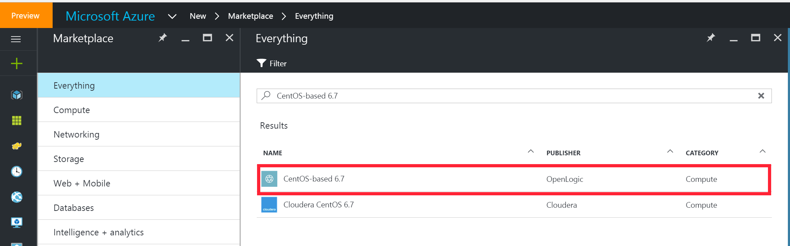

## Deploying a HDP 2.4 MultiNode HortonWorks Hadoop Cluster with Ambari on Azure

This tutorial walks through setting up a three node HortonWorks HDP 2.4 cluster using Azure virtual machines
found on the marketplace.  

### Prerequisites

1. An Active [Azure](https://azure.microsoft.com/) subscription. 

### Deploy Virtual Machines
Create three machines that will serve as resource manager, yarn and two nodes. 

1. Login to [Azure Portal](https://portal.azure.com)  

1. Navigate to Azure Market Place and search for **"CentOS-based 6.7"**. 

1. Select the **Open Logic** Version: 
        

    > **IMPORTANT NOTE**
    > CentOS 6.7 is used here to match the deployment environment of the native HDP 2.4 Sandbox from HortonWorks.
 
1. Deploy virtual machine deploy using the **Resource Manager** model:  
    

1. Enter Configuration settings:  
    

1. Choose virtual machine size:  
      

1. Set network and storage settings:  
Create a new storage account and network security group. Under the network security group, create various inbound rules. Port **8080** allows access to Ambari web view (for cluster installation and adminstration). 
      

    > IMPORTANT NOTE:  
    > It is advised to add this machine to the same virtual network as your SQL Server 2016 (IAAS). 
    > This makes accessibility and connectivity easier between nodes.  
     

1. Add more **Network Security Inbound rules**:  
Open up more relevant service TCP ports on the virtual machine needed by HDP.   
Other big data applications can be installed on HDP deployed VMs. On the security group, allow the following ports - 8000, 8888, 50070, 50095, 50075, 15000, 60010, 60030, 10000, 10001, 19888, 8443, 11000, 8050, 8993, 8744, 60080, 50111, 6080, 8088, 8080, 42080, 8020, 111, 8040, 4200, 21000, 9000, 
8983, 4040, 18080, 9995, 9090.  

      

1. Validate your configuration  
Make sure validation is successful before continuing.   
    

1. Create two more virtual machines following the steps above. 

### Attach extra storage disks to virtual machines
The local SSD attached to the virtual machine is not big enough to process big data. 

- Follow steps below to attach an extra data disk to all three virtual machines.  
 

- Format and mount the new data disk  
    1. Ssh into the first virtual machine

    1. The new disk for a newly created Azure virtual machine, running Ubuntu, will be **dev/sdc**.  
        -  List the mounted disks :  `ls /dev/sd?` 

    1. Mount new disk using the following options in this order :  **n, p, 1, default settings, w**
        - `fdisk /dev/sdc`  
        - Enter **n** to create a **new partition**    
        - Enter **p** to set disk as primary    
        - Enter **1** to set disk as 1st partition
        - Use default cylinder settings  
        -  Enter **w** to be able to write to disk  

    1. Set disk format `$ mkfs -t ext4 /dev/sdc1`  

    1. Make directory for mount point : `$ mkdir /data`  

    1. Mount new disk at mount point `$ mount /dev/sdc1 /data`   

 - Persist new disk at reboot  
    1. Change user to root : `sudo su`  
    
    1. Open `/etc/fstab`  
    
    1. Enter this entry : `/dev/sdc1    /data    ext4    defaults    0 0`  

    1. Save and exit file 

### Create and Set the Fully Qualified Domain Name (FQDN) for the Azure VMs
On each virtual machine, we will be updating the `/etc/hosts` file. Machines in the cluster need information of the hostname to IP address mappings.  

#### Create hostname FQDN for all machines 
1. Login to [Azure Portal](https://portal.azure.com)  

1. Go to Virtual Machines and select your machine(s)  

1. Click on **Overview > Public IP address/DNS name label > Configuration** and create a **DNS name label** and **Save**   
  

1. Make note of the created FQDNS and Private IP addresses (**Virtual Machines > Machine Name > Network Interfaces**)

1. **Repeat above steps for the other two machines.**  

#### Add Hostnames on all machines  
1. Ssh into first host.  

1. Check and change the hostname on the node.  
    - Switch to root : ` sudo su`
    
    - Check hostname for generic FQDN : 
        - Use `$ hostname -f` 
        - Confirm response like `new1.anea0capqknutosov1mgg1eawh.cx.internal.cloudapp.net`  

    - Update the hosts file 
        - Open `/etc/hosts` on machine 

        - Append the hostname to IP address mapping for all three nodes to `/etc/hosts`.   
        Assuming the private IP addresses are 10.0.0.1, 10.0.0.2 and 10.0.0.3 and machine names new1, new2, and new3
            ```
            10.0.0.1    new1    new1.eastus2.cloudapp.azure.com
            10.0.0.2    new2    new2.eastus2.cloudapp.azure.com
            10.0.0.3    new3    new3.eastus2.cloudapp.azure.com
            ```
        - Confirm updated hostname  
            - Use `$ hostname -f`
### Shutdown Iptables on the hosts 
On each machine, shutdown iptables

- Check service status : `service iptables status`  
If Iptables is ON, a similar output as image below will be seen  
  

- Turn off Iptables if needed : `service iptables stop`  
  

### Ensure SELinux on the the hosts is enabled, permissive and enforced
- Check status : `$ sestatus`  
 
### Restart and Update NTP Service on the hosts 
- Restart service : `/etc/init.d/ntpd restart`

- Update runlevel settings : `chkconfig ntpd on`

### Setup Passwordless Access  
Perform steps on all nodes.
- Create ssh keys : `ssh-keygen`

- Copy over public ssh key to other two nodes : `$ ssh-copy-id <ssh_user_created>@<other_hosts>`

### Activate Ambari Agent  


### Install HDP services using Ambari   

### Follow instructions  
Follow instructions to activate Ambari Agent and Install Hadoop from this [Youtube Link](https://www.youtube.com/watch?v=zutXwUxmaT4)  


