### Install HDP Hadoop Sandbox
1. Login on to [Azure Portal](https://portal.azure.com)  

1. Navigate to Azure Market Place and search for **"Hadoop"**. Select the HortonWorks Sandbox.  
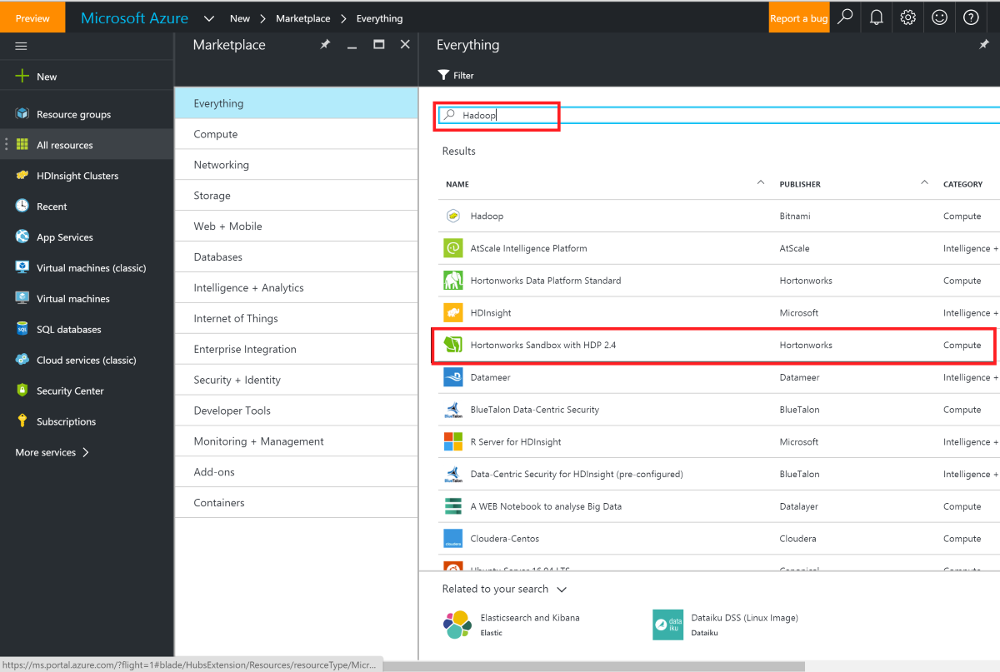

1.  Select Resource Manager as the deployment model.
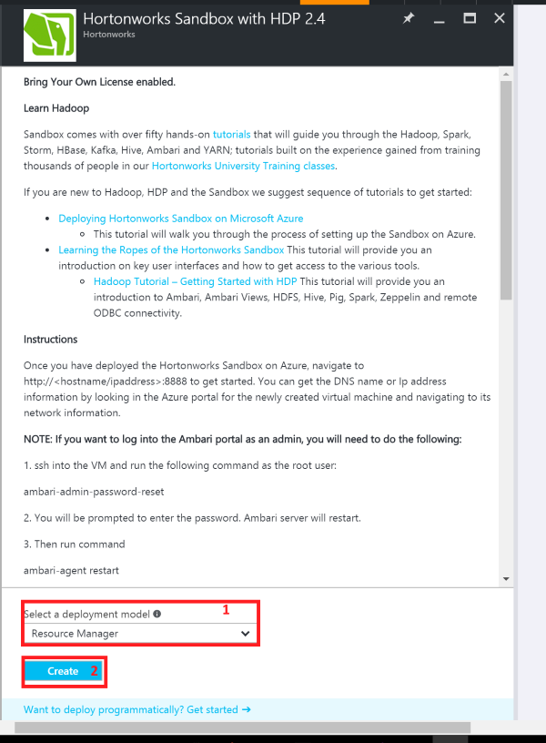  

1.  Set Sandbox basic settings.
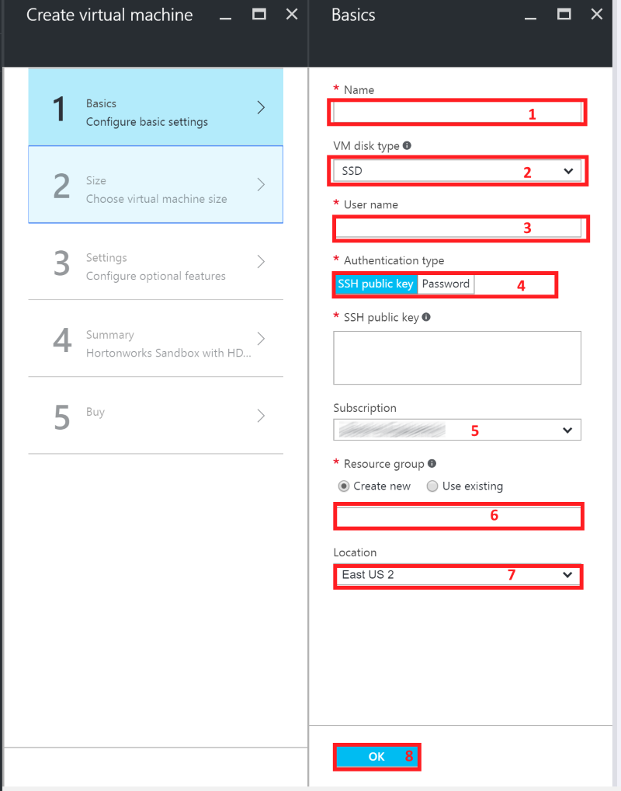

1.	Choose virtual machine Size.  
Available machines depend on your subscription. More cores and RAM gives better performance.   
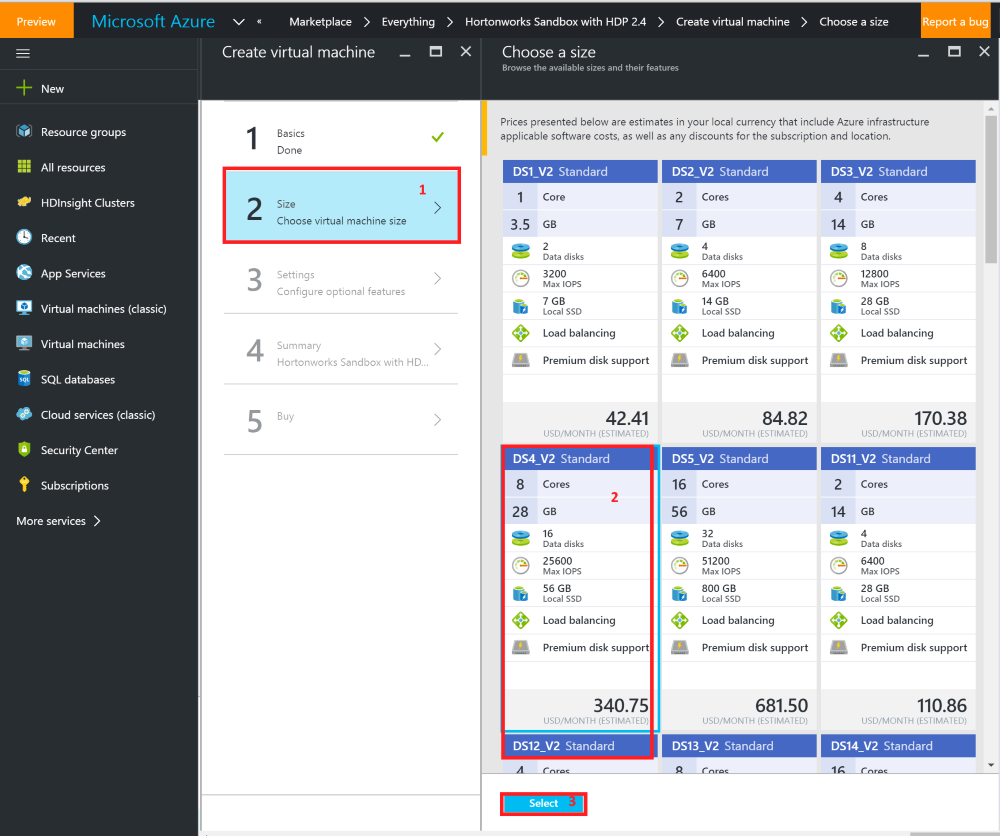

1. Set other features like network and storage.
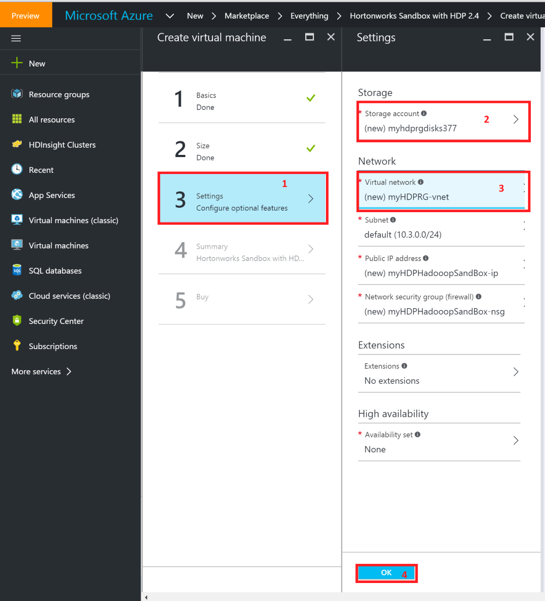

	> **IMPORTANT NOTE:**  
	>
	>it is advised to add this machine to the same Virtual Network as your SQL Server 2016 (IAAS). As both systems need visibility, this step makes connectivity easier between systems.

1. Validate your configuration.  
Make sure it passes successfully before continuing.
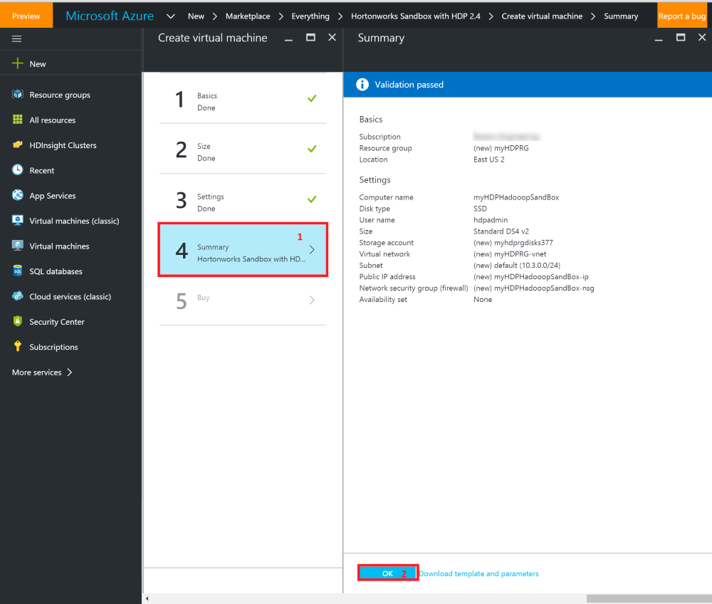

1. Read EULA and purchase.  
Make sure it passes successfully before continuing.
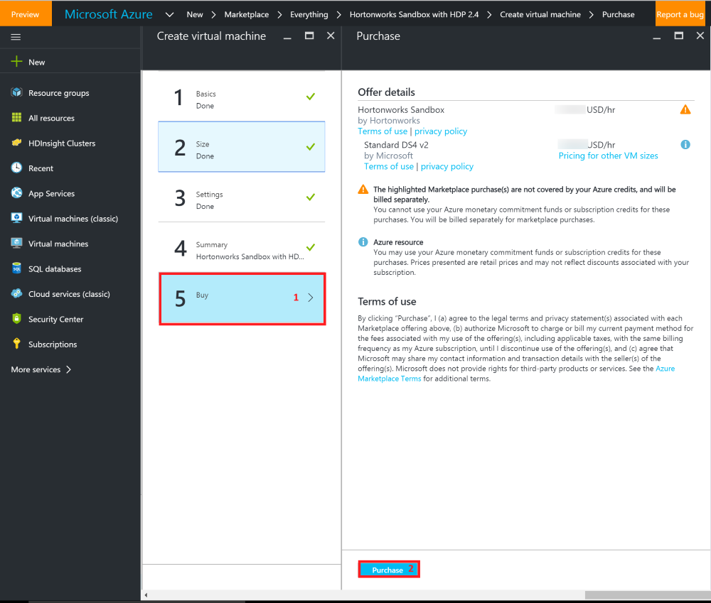

## Manage HDP VM via Ambari Views

### Activate access to Ambari  
By default Ambari WebUI is not activated on the HDP VM. A manual step is required.  

Activate the Ambari portal as an admin
via the following steps:  

1. ssh into the VM and run the following command as the root user  
`ambari-admin-password-reset`
1. When prompted enter a password. This action restarts Ambari server.  

1. Finally run command  
`ambari-agent restart`
1. Point browser to `http://<hostname/ipaddress>:8080`  
	- Enter the user "admin" and put the password you set up (via ssh on VM)

### Hadoop configuration and tuning used for HDP Hadoop VM  

>**IMPORTANT NOTE**
>  
> Changes have been made between MapReduce and MapReduce2. In MapReduce2 running on HDP (2.X), resource management can now be reused between engines. MapReduce can now focus completely on data processing while Resource Manager and YARN provides a user the ability to run multiple applications in Hadoop that share the same resources.  

#### Essential information and flags to set in configurations.
- On yarn-site.xml  
	- **yarn.nodemanager.resource.memory-mb** : Total amount of memory given to the Resource Manager.
	- **yarn.scheduler.minimum-allocation-mb** : Minimum RAM yarn allocates containers.
	- **yarn.nodemanager.vmem-pmem-ratio** : Memory allocations for Map tasks – Virtual memory upper limit.  
	- **yarn.nodemanager.resource.cpu-vcores** : Number of virtual cores allocated. Best practice is to have 1 or 2 containers per disk per core.
	- **yarn.nodemanager.delete.debug-delay-sec** : For diagnosing YARN application problems. It's the number of seconds after application execution for nodemanager's deletion service to clean up the localized file and log directories. A value of 600 means 10 minutes.

- On mapred-site.xml
	- **mapreduce.map.memory.mb** : Memory size for Map tasks.
	- **mapreduce.reduce.memory.mb** : Memory size for Reduce tasks. Should be twice Map size.
	- **mapreduce.map.java.opts** : Upper limit of the physical RAM for Map task JVM.
	- **mapreduce.reduce.java.opts** : Upper limit of the physical RAM for Reduce task JVM.

These tuning parameters can be made directly on the xml configuration files or managed via Ambari. We will use Ambari to make these configurations, save the updated files and copy them over to the Hadoop directory under PolyBase installation.

#### Set MapReduce2 configurations.
- Login to Ambari view with **_admin_** as username and the password you created via ssh.
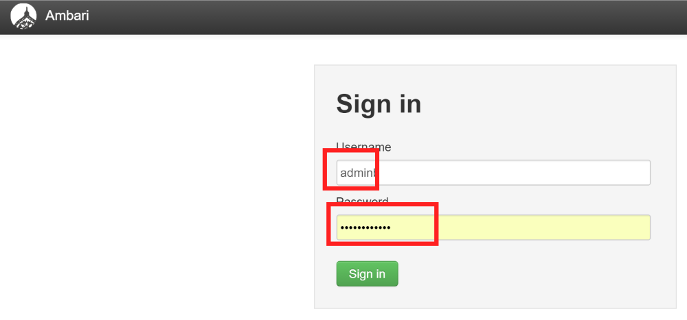  

- Begin tuning of MapReduce2 service memory settings.
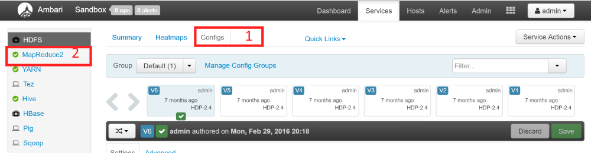   

	Create a new Configuration Group (**TestGroup** in this case). Default group is not allowed to be modified.
	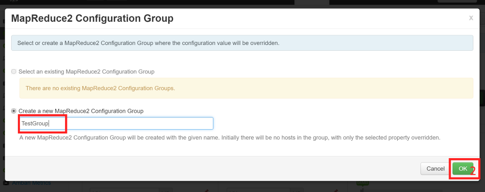

	Click on `Manage Hosts` to attach our VM to this new Configuration Group.  
	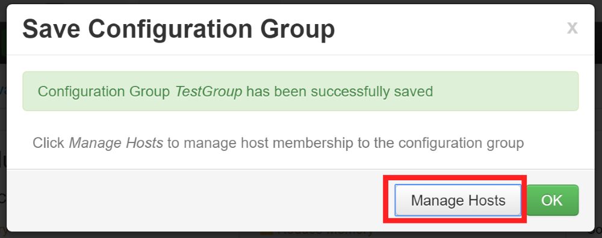

	Attach VM to Configuration Group.
	

	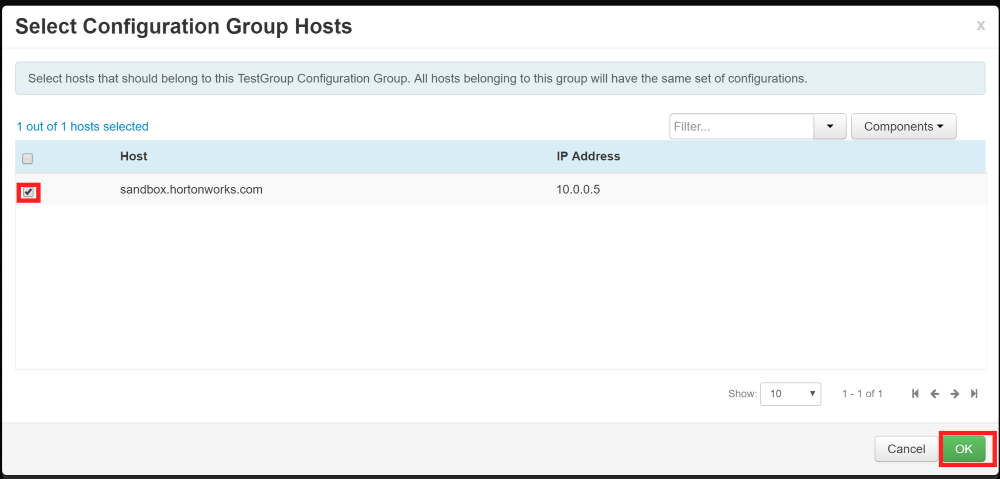  

	Make memory modifications in new group.
	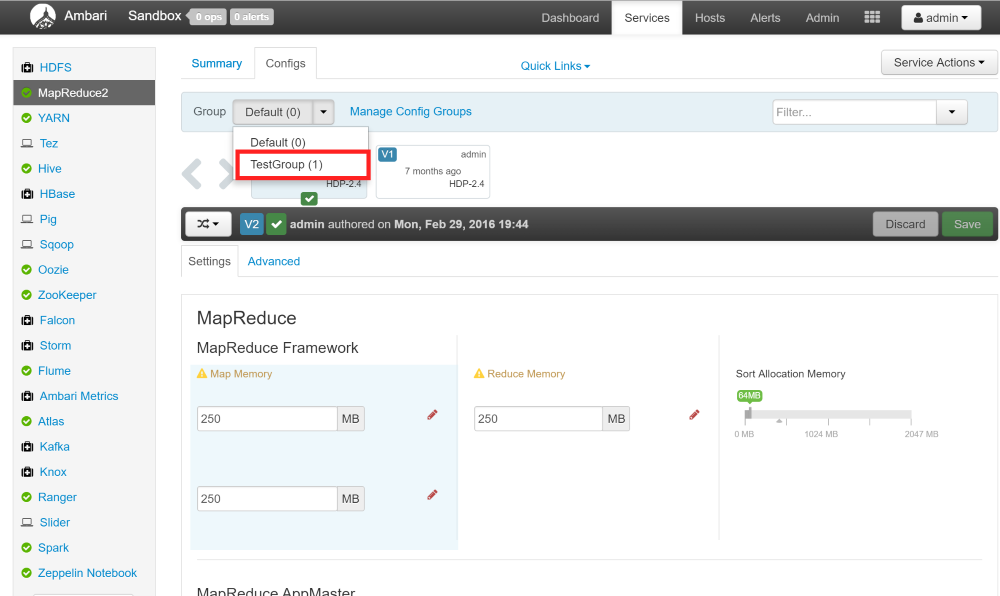   

	Override memory settings by clicking on the **Override** symbol.
		  

	Increase the map and reduce memory. In this scenario for a 28GB Ram and 2 Core machine, set the Map Memory to 4GB (4098MB) and Reduce Memory as 8GB (8192MB). Sort Allocation Memory adjusts by default to half the size of the Map Memory.  Save configuration changes.
	> NOTE
	> The rectangles in blue alert you that there are other dependent services that need to be adjusted with memory updates for MapReduce Framework.    

	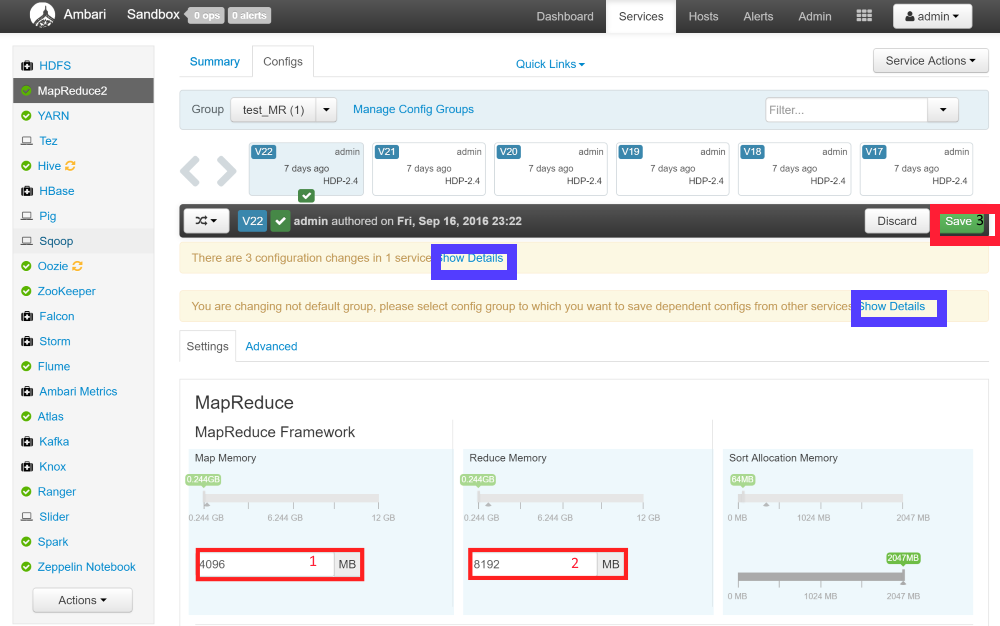  

	Confirm settings update for the dependent services, highlighted by the blue rectangle, in diagram. These changes in the **Recommended Value** Column are auto adjusted and optimized based on memory allocations for the MapReduce2 Framework. They are **recommended and not enforced**. Easily uncheck the box to avoid updating it and keeping the current value. Click **OK** to save.
	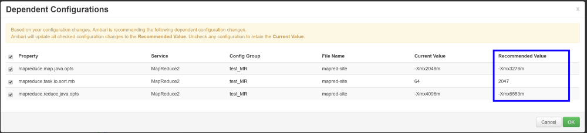  

	Restart MapReduce service after this modification to validate modifications.
	, download and save the updated MapReduce configuration settings.
	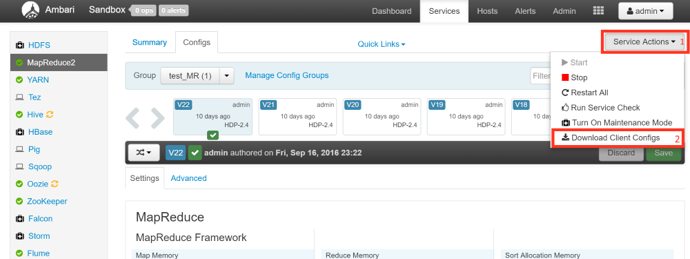  

#### Set YARN configurations.
- Follow the same steps for MapReduce2 to create a new configuration group.

- Switch to the new **YARN** configuration group to make memory modifications.  
	Set total memory allocations for all YARN containers on a node via UI.  

	- Rectangle 1 sets `yarn.nodemanager.resource.memory-mb` to 21248MB (this value depends on your optimization needs. Just remember to leave some physical memory for the VMs operating system).
	- Rectangle 2 sets `yarn.scheduler.minimum-allocation-mb` to 2048MB
	- Rectangle 3 sets `yarn.nodemanager.resource.memory-mb`. Overwrite the value to match value used in `yarn.nodemanager.resource.memory-mb` (i.e. 21248MB in this case).

	  

- Update application and log deletion service timer.
Click on **Advanced** tab besides **Settings**, expand the **Advanced yarn-site** and override the value of  **yarn.nodemanager.delete.debug-delay-sec** to **1200** (for 20 minutes debug/log files retention).  
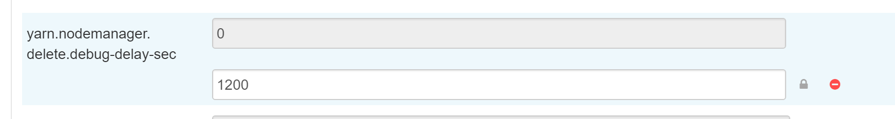  
Click the **Save** button and make a note of your update for versioning purposes.

	**NOTE:**  
	After application execution, the YARN deletion service kicks in to clean up cache, and temporary files created during the execution. The log files are also wiped. For diagnosing, we need to modify this value in Ambari.  

	Restart YARN service after this modification to validate modifications. After restart, download and save the updated YARN configuration settings for your records.
	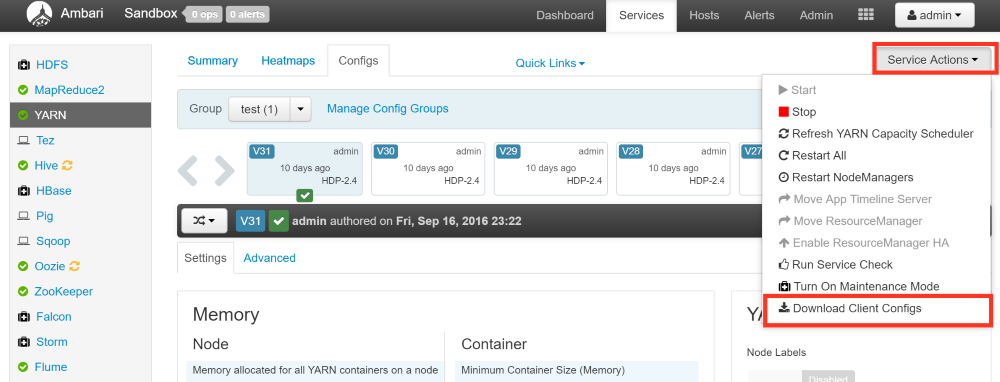  

> IMPORTANT NOTE  
> It is very important to set these options in the yarn-site.xml and mapred-site.xml on the PolyBase version of these files.  
>
> PolyBase’s Hadoop configuration should have pushdown specific values for mapred-site.xml, while the yarn-site.xml will be modified on Ambari for the server-side. This step is required as these configuration values may be overridden or conflict with the Ambari services version. Copy over the downloaded mapred-site.xml configurations to **C:\Program Files\Microsoft SQL Server\MSSQL13.MSSQLSERVER\MSSQL\Binn\Polybase\Hadoop\conf**. Remember to backup the existing files.
