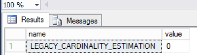

<properties
	pageTitle="Data Warehouse for Advanced Hybrid Analytics | Microsoft Azure"
	description="Data Warehouse for Advanced Hybrid Analytics."
	keywords="hdi, azure sql data warehouse, sql server 2016, polybase, jdbc, sparksql"
	services="sql-data-warehouse,sql-database,hdinsight,polybase,hadoop"
	documentationCenter=""
	authors="emawa"
	manager="roalexan"
	editor=""/>

<tags
	ms.service="sql-data-warehouse"
	ms.workload="data-services"
	ms.tgt_pltfrm="na"
	ms.devlang="na"
	ms.topic="article"
	ms.date="08/23/2016"
	ms.author="emawa" />

# Data Virtualization Patterns for Advanced Hybrid Analytics
A lot of companies now rely on data to make decisions that advance organizational growth, drive business decisions, generate profitability and so on. With the velocity of data generated from disparate sources, these companies' data have the potential of residing both on premises and in cloud
depending on the situations. There is a growing need to leverage a hybrid on-prem/cloud system for possible data congregation routes. 

The purpose of this tutorial is to discuss some identified use cases and solutions to achieve them using Microsoft Azure products.  

These identified patterns are not just recurring for various clients, but appears to be the growing business process trend. We've done some research and put together this tutorial that tries to cover these cases.

A few possible scenarios are:

- Systems on-premises marshal off large data computation to the cloud; results are sent back on-premises to applications dependent on this results.  

- The user may want to be closest to the largest source of data (locality of reference), probably relational, while integrating and referencing NoSQL data like click stream information to drive sales.  

- Leverage SQL knowledge both on-prem and in cloud on both relational and non-relational data.

- Avoiding low throughput on your data pipeline due to constant large data transfers

- Segregation and security of sensitive information on-prem while using the cloud for large crunching of other types of data.

- Avoid replication of business logic on multiple systems; save time, be more efficient, minimize latency and network I/O using incremental copying.

#### TAGS - Data Warehouse, HDInsight, Azure, Azure Blob Storage, SQL Server 2016, Azure IAAS, NoSQL, SQL On-Prem, SparkSQL  

## Scope and Prerequisites
This tutorial helps you create end-to-end (E2E) deployment ready pipelines for each use case. Each pipeline shows one
Azure Data virtualization capability using Azure products. For example SQL Data Sources (SQL Server 2016 (IAAS), Azure Data Warehouse), Azure Storage, PolyBase, and HDInsight.  

The tutorial will describe the overall approach through the following steps:  

1. ARM deployment of Azure Resources.  

1. Creating and loading of sample datasets.

1. Running SQL-like transactions either on On-Prem SQL Server 2016, SQL Data Warehouse and/or  Spark-Shell using SparkSQL depending 
on the given use case.


We assume the following prerequisites are fulfilled -  

1. An Active [Azure](https://azure.microsoft.com/) subscription.

1. Access to the latest [Azure PowerShell](http://aka.ms/webpi-azps) to run (CLI) commands 

## Use Cases
1. [Migrating data from On-Premises SQL sources to HDInsight external tables using PolyBase and Azure Blob](#migrating-sql-data-to-hdi-using-polybase-and-blob)
3. [Integrating Transactional NoSQL Data in HDInsight with Referential/Relational Data in SQL DW](#integrating-nosql-data-from-hdinsight-with-relational-data-on-sql-datawarehouse)

## Migrating SQL data to HDI using PolyBase and Blob
#### Use Case Summary

**MIGRATORY ROUTE FROM ON-PREMISES SQL SOURCES TO HDINSIGHT USING POLYBASE AND AZURE BLOB.**  

With the growth of data, clients will require a more robust workflow for ETL jobs. 
The option of migrating big data to cloud for this task is becomging very useful. 
Needless to say, applications that are dependent on on-prem infrastructure would need
 to still be supported, while the ETL is run in cloud. This use case covers a pattern of projecting data, using Polybase, to HDInsight clusters targetting external tables that are backed by Azure Blob.  

PolyBase opens up a bigger opportunity for data processing and analytics. 

- It provides integration between traditional SQL sources (SQL Server 2016, SQL DW, Parallel DW) and other big data platforms like Hadoop.  

-  With Standard SQL (as against MapReduce), customers can integrate Hadoop and relational data.

- Achieve query scale out and execution performance by predicate push-down to your already existing Hadoop clusters.

PolyBase support for transactional SQL (T-SQL) varies slightly on what SQL compute platform in question.   

For instance PolyBase does not support `UPDATE` and `DELETE` statements at the time of writing this. However, such `DML` actions can be achieved using `CREATE EXTERNAL AS SELECT`
on SQL DW and Parallel DW while on SQL Server 16 customers can achieve this by first creating an external table `CREATE EXTERNAL TABLE` (with schema definition) and then a separate `INSERT INTO TABLE AS SELECT` to populate the external table. Intermediate temporary tables need to be created and then `RENAME` command used to overwrite the old table.

> For details examples see [CTAS](https://msdn.microsoft.com/en-us/library/mt204041.aspx) and [CETAS](https://msdn.microsoft.com/en-us/library/mt631610.aspx) for SQL DW and Parallel DW examples.

#### Some T-SQL, HiveQL/ANSI SQL syntax intersections

##### Renaming a table
Supported on both T-SQL and HIVE with slight differences.
- [T-SQL](https://msdn.microsoft.com/en-us/library/mt631611.aspx)
	- SQL DW/PDW
    
    ```  
	RENAME OBJECT [ :: ]  [ [ database_name .  [schema_name ] ] . ] | [schema_name . ] ] table_name TO new_table_name [;]  
  
    ```
    
    - SQL Server and DB : Use Stored Procedure [sp_renamedb](https://msdn.microsoft.com/en-us/library/ms186217.aspx)
    
    ```
    sp_renamedb [ @dbname = ] 'old_name' , [ @newname = ] 'new_name'  
    
    ```

- [HIVE](http://www.tutorialspoint.com/hive/hive_alter_table.htm)

```
ALTER TABLE name RENAME TO new_name
```

##### Cloning Table schema without copying data (Create Table Like - CTL) 
Supported directly on [HIVE](https://cwiki.apache.org/confluence/display/Hive/LanguageManual+DDL#LanguageManualDDL-CreateTableLike) alone. 

```
CREATE TABLE newEmptyTableWithSchema LIKE realTableWeNeedSchemaFrom;
```

However, you can achieve a similar result in T-SQL using a `SELECT INTO` statement

```
 SELECT TOP 0 * INTO newEmptyTableWithSchema FROM realTableWeNeedSchemaFrom;
```


##### Creating External Tables
Supported on [HIVE](http://www.tutorialspoint.com/hive/hive_create_table.htm) and [T-SQL with PolyBase alone](https://msdn.microsoft.com/en-us/library/mt163689.aspx) on SQL Server 16 and Data Warehouse (SQL and Parallel).  


##### Creating Table As Select (CTAS) 
Supported on [HIVE](https://cwiki.apache.org/confluence/display/Hive/LanguageManual+DDL#LanguageManualDDL-CreateTableAsSelect(CTAS)) and T-SQL for [Azure SQL DW and Parallel DW](https://msdn.microsoft.com/en-us/library/mt204041.aspx)

##### Creating External Table As Select (CETAS)
Supported in T-SQL (with PolyBase) on [Azure SQL DW and Parallel DW](https://msdn.microsoft.com/en-us/library/mt631610.aspx) but **NOT** supported in HIVE.    

Hive supports only **CTAS** with the following ceveats **FULLY** documented on [Apache Hive Confluence Page](https://cwiki.apache.org/confluence/display/Hive/LanguageManual+DDL)  

> CTAS has these restrictions:  
The target table cannot be a partitioned table.  
_**The target table cannot be an external table.**_   
The target table cannot be a list bucketing table.


##### Update
Supported on [T-SQL](https://msdn.microsoft.com/en-us/library/ms177523.aspx) for internal tables. 

> NOTE  
`UPDATE` is not supported on external tables. Only the following are allowed on external tables.  
- CREATE and DROP TABLE  
- CREATE AND DROP STATISTICS  
- CREATE AND DROP VIEW  

>For further information check [Limitations and Restrictions of T-SQL Create External Table](https://msdn.microsoft.com/en-us/library/dn935021.aspx)

Support for [HIVE] is available from [version 0.14](https://cwiki.apache.org/confluence/display/Hive/LanguageManual+DML#LanguageManualDML-Update) on tables that support ACID


##### Delete
Supported on [T-SQL](https://msdn.microsoft.com/en-us/library/ms189835.aspx) for internal tables.
> NOTE  
No `DML` is allowed on external tables.  
Find more information [here.](https://msdn.microsoft.com/en-us/library/mt631610.aspx)

Support for [HIVE] is available from [version 0.14](https://cwiki.apache.org/confluence/display/Hive/LanguageManual+DML#LanguageManualDML-Update) on tables that support ACID


##### Insert Into Select

Supported in [HIVE](https://cwiki.apache.org/confluence/display/Hive/LanguageManual+DML#LanguageManualDML-InsertingdataintoHiveTablesfromqueries) and [T-SQL](https://msdn.microsoft.com/en-us/library/ms174335.aspx)  

#### Benefit(s)  
- Delegation of time consuming processes/jobs to the cloud for parallelized computations. 

- Queries can be easily scaled out.  

- Sensitive data can be left On-Prem while the cloud be leveraged to work on less sensitive parts of the process flow.  

- A one-time PolyBase bulk push (INSERT) and Azure Data Factory (with PolyBase) can be used for incremental delta copies.

- Provide a very logical data migratory route while guaranteeing continous uptime for applications dependent on On-Prem data sources.  

#### Pipeline  
The architecture of this pattern can be broken down into two cases.  

1. **Initial Bulk Copy -** The entire data is projected one time using PolyBase to your HDInsight cluster using external tables. 
  

1. **Incremental Delta Data Copy -** Copy activity for modified rows or changes in data can be easily orchestrated using ADF with PolyBase support.  
 

#### Resource Deployment  
Clicking button below creates a new `blade` in Azure portal with the following resources deployed:

1. One SQL Server 2016 (IAAS)  

1. A four node HDInsight cluster - _two head nodes and two worker nodes_.

<a target="_blank" id="deploy-to-azure" href="https://portal.azure.com/#create/Microsoft.Template/uri/https%3A%2F%2Fbostondata.blob.core.windows.net%2Fedw-data-virtualization%2Fazuredeploy_UC1.json"></a>


#### Data Source
1. Product table from AdventureWorks2012.

**Essential House keeping**  
> From SSMS, you may encounter the following error message while trying to export your tables. 
>
>  
>`Queries that reference external tables are not supported by the legacy cardinality estimation framework. Ensure that trace flag 9481 is not enabled, the database compatibility level is at least 120 and the legacy cardinality estimator is not explicitly enabled through a database scoped configuration setting.`  
>
> The following configurations must be set correctly. 
> 1. PolyBase must be allowed to export external tables.
> 1. The legacy compability estimation must be turned off.  
> 1. Your database compability level must be at least 120.


- Allow PolyBase to export external tables  
```
sp_configure 'allow polybase export', 1;
RECONFIGURE;
```

- Confirm legacy compability estimation is turned off.  
```
SELECT  name, value  
    FROM  sys.database_scoped_configurations  
    WHERE name = 'LEGACY_CARDINALITY_ESTIMATION';  
```

If set correctly, you would see  

  

- Check database compatibility level and alter to at least 120 if needed.  

Display all database levels
```
SELECT    d.name, d.compatibility_level  
    FROM  sys.databases AS d;
```

Alter level if needed, for my case I chose 130.

```
SELECT ServerProperty('ProductVersion');  
go  
  
ALTER DATABASE your_database_name  
    SET COMPATIBILITY_LEVEL = 130;  
go  
  
SELECT    d.name, d.compatibility_level  
    FROM  sys.databases AS d  
    WHERE d.name = 'your_database_name';  
go  

```

Outputs  

| name          | compability_level
| ------------- |:-------------:| 
| `your_database_name`| 130 | 
  

At this point, our SQL Server 2016 is ready to support PolyBase transactions.


### Required PolyBase Objects    
The following PolyBase T-SQL objects are required. 

1. Database scoped credential 

1. External Data source  

1. External file format  

1. Blank external table on Azure Blob  

####  Create the T-SQL objects 
Polybase can create objects that depend on either Hadoop or Azure Blob. For the purposes of this tutorial, we will be creating our external data source that depends on the latter.
Connect to the earlier created database on SQL DW and following instructions below.  

**LINKS**  - You can interact with SQL Server 2016 via [Visual Studio](https://www.visualstudio.com/) or [Microsoft SQL Server Management Studio](https://msdn.microsoft.com/en-us/library/mt238290.aspx).  

- Create a master key on the database.  
This step is very important to encrypt the credential secret during network I/O transmission.

```
CREATE MASTER KEY ENCRYPTION BY PASSWORD = 'Us3@M0reS3cur3dP@ssw0rd!';
```

- Use master key to create a database scoped credential for our Azure blob storage.  
*Parameters:*  
    - **IDENTITY:** Any string identifier (not used for authentication). *Preferrably use your storage name*.  
    - **SECRET:** Your Azure storage account key (can be found on [Azure Portal](portal.azure.com))

```
CREATE DATABASE SCOPED CREDENTIAL AzureStorageCredential
WITH IDENTITY = '<your_storage_name>', Secret = '<storage_account_access_key>';
```

- Create your external data source. 

*Parameters:* 
    - **LOCATION:**  Wasb path to Azure account storage account and blob container.  
    - **CREDENTIAL:** The database scoped credential we created earlier. 

```
CREATE EXTERNAL DATA SOURCE AzureStorage WITH (
	TYPE = HADOOP,
	LOCATION = 'wasbs://<blob_container_name>@<azure_storage_account_name>.blob.core.windows.net',
	CREDENTIAL = AzureStorageCredential	
);
```

- Create an file format for external source.  
In Polybase this is important to describe the format/structure of the input data.  
*Parameters:*  
    - **FORMAT TYPE:** Data format in Azure Blob. *Examples DELIMITEDTEXT,  RCFILE, ORC, PARQUET.*   

```
CREATE EXTERNAL FILE FORMAT TextFileFormat WITH (
	FORMAT_TYPE = DELIMITEDTEXT,
	FORMAT_OPTIONS (FIELD_TERMINATOR = ',', USE_TYPE_DEFAULT = TRUE)
);
```


#### Create an external table and define table schema to hold data.

> **Important Note**  
The external table's schema definitions must match the schema of table we are trying to project. Decompose defined data types, like `FinishedGoodsFlag`, into its underlying data type `BIT`. 


##### Expand the `Columns` folder in SQL Server Management Studio (SSMS) to examine.   

  


##### Point External table to Blob container

 > **IMPORTANT**  
  > WASB must be able to find the Azure Storage account key in it's configuration. Using `SET` statement to provide a new secret key will not work. `CREATE TABLE` runs in the metastore service and has not visibility to the `SET` statements. Hence no runtime configuration changes will be used. 
  >
  > **Remedy -** Create extra containers in the Storage Account attached to the HDI Cluster and save any extra data. Easily achieve this using [Azure portal](https://portal.azure.com/signin/index/?cdnIndex=4&l=en.en-us) or [Azure Storage Explorer](http://storageexplorer.com/),


```
CREATE EXTERNAL TABLE Product(
	ProductID INT,
	Name NVARCHAR(50),
	ProductNumber nvarchar(25),
	MakeFlag BIT,
	FinishedGoodsFlag BIT,
	Color NVARCHAR(15),
	SafetyStockLevel smallint,
	ReorderPoint smallint,
	StandardCost money,
	ListPrice money,
	Size NVARCHAR(5) ,
	SizeUnitMeasureCode NCHAR(3) ,
	WeightUnitMeasureCode NCHAR(3),
	Weight decimal(8, 2),
	DaysToManufacture int,
	ProductLine NCHAR(2),
	Class NCHAR(2),
	Style NCHAR(2),
	ProductSubcategoryID int,
	ProductModelID int,
	SellStartDate datetime,
	SellEndDate datetime ,
	DiscontinuedDate datetime,
	rowguid NVARCHAR (255),
	ModifiedDate datetime
)
WITH (LOCATION='/product',
	  DATA_SOURCE = AzureStorage,
	  FILE_FORMAT = TextFileFormat
);
```

*Parameters:*  
1. **LOCATION:** Path to a file or directory that contains the actual data (this is relative to the blob container described earlier).  
	- To point to all files under the blob container, use **LOCATION='/'**  

##### Project and export data  
Move on-prem data to Azure blob using Polybase.  
`INSERT INTO dbo.Product SELECT * FROM AdventureWorks2012.Production.Product;`  

At this point, our data is exported sucessfully Azure Storage. It is easily accessible from HDI, for instance, using Hive or Spark query languages. Update and Merge can easily be achieved where HDI outputs to blob or other destinations.

>For detailed information on [Creating PolyBase T-SQL objects](https://msdn.microsoft.com/en-us/library/mt652315.aspx). 

##### Integrate exported data back to HDI  (Hive example) 
The exported data can now be loaded back to HDI for ETL, Update or Merge tasks.

```
CREATE DATABASE IF NOT EXISTS DATAANALYTICS;
CREATE EXTERNAL TABLE DATAANALYTICS.Product(
	ProductID INT,
	Name string,
	ProductNumber string,
	MakeFlag int,
	FinishedGoodsFlag int,
	Color string,
	SafetyStockLevel smallint,
	ReorderPoint smallint,
	StandardCost decimal(18, 2),
	ListPrice decimal(18, 2),
	Size string,
	SizeUnitMeasureCode string,
	WeightUnitMeasureCode string,
	Weight decimal(8, 2),
	DaysToManufacture int,
	ProductLine string,
	Class string,
	Style string,
	ProductSubcategoryID int,
	ProductModelID int,
	SellStartDate timestamp,
	SellEndDate timestamp ,
	DiscontinuedDate timestamp,
	rowguid string,
	ModifiedDate timestamp
)
ROW FORMAT DELIMITED FIELDS TERMINATED BY ',' 
LINES TERMINATED BY '\n'
STORED AS TEXTFILE LOCATION 'wasb://<container_name>@<storage_account_name>.blob.core.windows.net/product';
``` 

> Specific Hive queries to be ran on 
this table is beyond the scope of this tutorial.   

At this point, the `Product` external table is available to the HDInsight cluster for processing. Results from parallelized jobs (on the Product table) 
can equally be saved back to the blob location, to be easily re-ingested back to the SQL Server 2016 using PolyBase, for instance.  

```
SELECT * FROM Product;
```   


## Integrating NoSQL Data From HDInsight With Relational Data on SQL Datawarehouse 

## Use Case Summary   
**INTEGRATING TRANSACTIONAL NoSQL DATA WITH REFERENTIAL/RELATIONAL DATA FROM SQL DW ON HDInsight**

Currently, integrating data residing on On-Prem Hadoop systems with Azure compute platforms, like SQL Datawarehouse, 
is not a trivial process.  

In order to get better end-to-end throughput, an intermediate copy to blob would be needed; using **PolyBase and Azure Data Factory StagedCopy**. Azure Data Factory is able to apply transformations that match PolyBase/SQL source requirements.  

>Check out [Staged Copy using PolyBase](https://azure.microsoft.com/en-us/documentation/articles/data-factory-azure-sql-data-warehouse-connector/#staged-copy-using-polybase) for further details.  

This workflow, although offers a way to virtualize data on-prem and in cloud, focuses more on data copy and not integration nor harmonization. This can easily get expensive in terms of resources (for staged copy), security concerns (additional step to encrypt) and so on.   

Our tutorial tries to focus on harmonization processes and routes, hence we will achieve the update and merge using Hadoop sources in Azure.  

#### Benefit(s)  
- Click stream (NoSQL) data, like realtime sales information, can be combined with referential (SQL) data, like products in stock, to decide
how to control inventory of products for profitability and business intelligence.

- Queries can be scaled out and parallelized using Hive, HBase or Spark.  

- HDInsight, out of the box, supports connectivity to relational data sources via `JDBC`. Using Views, complex joins can be 
materialized on SQL Datawarehouse and results pulled into Spark for further processing.

- Complex joins can be done between Facts and Dimensionals, allowing easier Update and Merge operations. 

#### Pipeline  
  

#### Resource Deployment  
Clicking button below creates a new `blade` in Azure portal with the following resources deployed:  

1. One Azure SQL Data Warehouse
1. A four node HDInsight cluster - _two head nodes and two worker nodes._

<a target="_blank" id="deploy-to-azure" href="https://portal.azure.com/#create/Microsoft.Template/uri/https%3A%2F%2Fbostondata.blob.core.windows.net%2Fedw-data-virtualization%2Fazuredeploy_UC2.json"></a>

#### Data Source
1. We will be using the **FactInternetSale** table from the **AdventureWorks** Dataset.

> **Columns -** `ProductKey, OrderDateKey, DueDateKey, ShipDateKey, CustomerKey, PromotionKey, CurrencyKey, SalesTerritoryKey, SalesOrderNumber, SalesOrderLineNumber, RevisionNumber, OrderQuantity, UnitPrice, ExtendedAmount, UnitPriceDiscountPct, DiscountAmount, ProductStandardCost, TotalProductCost, SalesAmount, TaxAmt, Freight, CarrierTrackingNumber, CustomerPONumber
`  

#### Start the spark shell pointing to the JDBC connector.  
With the JDBC defined variables, connect and load data from the SQL DW table.  

  **NOTE:** All JDBC jar files are available on HDI Clusters by default at **/usr/hdp/<version_of_hdp_number>/hive/lib/**  

```
$SPARK_HOME/bin/spark-shell --jars  /usr/hdp/current/hive-server2/lib/sqljdbc4.jar
```

If Spark shell loads successfully, we can now connect to the SQL DW Table **FactInternetSale** and read the table.  
The following Scala code defines connection variables to an Azure SQL Data Warehouse table and connects to the external table; making it available for querying.    

```
scala> val url = "jdbc:sqlserver://<yoursqllogicalserver>.database.windows.net:1433;database=<db_name>;user=<user_name>@<my_sqllogical_server_name>;password=<your_password>"  
```

```
scala> val driver = "com.microsoft.sqlserver.jdbc.SQLServerDriver"  
```

```
scala> val table = "FactInternetSales"
```

**NOTE**  
Since our exercise implements a hybrid query harmonization between SQL DW and NoSQL, we will use the hiveContext. This will give us the SparkSQL commands and also Hive functionalities that will 
let use perform joins. We need to do this because temporary tables are registered in-memory and attached to a specific SQLContext.

#### Construct a HiveContext (with SQL implicit commands) and fetch data from SQL DW.

- Import HiveContext package

```
scala> import org.apache.spark.sql.hive.HiveContext

```

- Construct a HiveContext and attach to existing Spark context.  

  In order to work with Hive from Spark, you must construct a HiveContext.  

  **NOTE** -  HiveContext inherits from SQLContext and also benefits from all SQL commands available from SQLContext. It is still possible to create a HiveContext without a Hive deployment. For details visit [Spark SQL Docs](http://spark.apache.org/docs/latest/sql-programming-guide.html)  

```
scala> val hiveContext = new org.apache.spark.sql.hive.HiveContext(sc)
```

```
scala> import hiveContext.implicits._
```

- Fetch data from SQL Data Warehouse

```
scala> val dw_factInternetSales = hiveContext.read.format("jdbc").option("url", url).option("driver", driver).option("dbtable", table).load()
```

To confirm a success connection, we should get a description of the columns of the table **FactInternetSales** as a **dataframe** `df`  

> df: org.apache.spark.sql.DataFrame = [ProductKey: int, OrderDateKey: int, DueDateKey: int, ShipDateKey: int, CustomerKey: int, PromotionKey: int, CurrencyKey: int, SalesTerritoryKey: int, SalesOrderNumber: string, SalesOrderLineNumber: int, RevisionNumber: int, OrderQuantity: int, UnitPrice: decimal(19,4), ExtendedAmount: decimal(19,4), UnitPriceDiscountPct: double, DiscountAmount: double, ProductStandardCost: decimal(19,4), TotalProductCost: decimal(19,4), SalesAmount: decimal(19,4), TaxAmt: decimal(19,4), Freight: decimal(19,4), CarrierTrackingNumber: string, CustomerPONumber: string]

You can view the data in `dw_factinternetsales` by a call to action `.show`. This will display the **top 20 rows** by fetching results from the executors back to the driver node.

```
scala> dw_factInternetSales.show
```

To view the dataframe schema.  

```
scala> dw_factInternetSales.printSchema
```

You should a similar output as the following:  

>root  
 |-- ProductKey: integer (nullable = false)   
 |-- OrderDateKey: integer (nullable = false)  
 |-- DueDateKey: integer (nullable = false)  
 |-- ShipDateKey: integer (nullable = false)  
 |-- CustomerKey: integer (nullable = false)  
 |-- PromotionKey: integer (nullable = false)  
 |-- CurrencyKey: integer (nullable = false)  
 |-- SalesTerritoryKey: integer (nullable = false)  
 |-- SalesOrderNumber: string (nullable = false)  
 |-- SalesOrderLineNumber: integer (nullable = false)  
 |-- RevisionNumber: integer (nullable = false)  
 |-- OrderQuantity: integer (nullable = false)  
 |-- UnitPrice: decimal(19,4) (nullable = false)  
 |-- ExtendedAmount: decimal(19,4) (nullable = false)  
 |-- UnitPriceDiscountPct: double (nullable = false)  
 |-- DiscountAmount: double (nullable = false)  
 |-- ProductStandardCost: decimal(19,4) (nullable = false)  
 |-- TotalProductCost: decimal(19,4) (nullable = false)  
 |-- SalesAmount: decimal(19,4) (nullable = false)  
 |-- TaxAmt: decimal(19,4) (nullable = false)  
 |-- Freight: decimal(19,4) (nullable = false)  
 |-- CarrierTrackingNumber: string (nullable = true)  
 |-- CustomerPONumber: string (nullable = true)  


Now we will register our dataframe as a table in our SQLContext i.e. making it queriable like another relational table  
```
scala> dw_factInternetSales.registerTempTable("DW_FactInternetSales")
```

We now have a queriable SQL Data Warehouse table from a Spark SQLContextSQL. Table is registered as a temporary table and has all SQL commands available to SQLContext.  
To verify the data, a quick select will show this.  

```
scala>  hiveContext.sql("SELECT * FROM DW_FactInternetSales LIMIT 10").show
```

Next we want to pull our NoSQL data. 

- Fetch NoSQL Data from HDInsight (from Blob Storage) via HiveContext

Spark gets Hive for free using the HiveContext. To work with Hive (our NoSQL data is imported using a HiveContext), 
we must create a HiveContext.   

```
scala>  val hdi_factInternetSales = hiveContext.jsonFile("wasb://<your_storage_name>@<your_storage_account>.blob.core.windows.net/FactInternetSales.json")
```

To confirm a sucessful load, print the `hdi_factInternetSales` schema.

```
scala> hdi_factInternetSales.printSchema
```

>root
 |-- CarrierTrackingNumber: string (nullable = true)  
 |-- CurrencyKey: string (nullable = true)  
 |-- CustomerKey: string (nullable = true)  
 |-- CustomerPONumber: string (nullable = true)  
 |-- DiscountAmount: string (nullable = true)  
 |-- DueDateKey: string (nullable = true)  
 |-- ExtendedAmount: string (nullable = true)  
 |-- Freight: string (nullable = true)  
 |-- OrderDateKey: string (nullable = true)  
 |-- OrderQuantity: string (nullable = true)  
 |-- ProductKey: string (nullable = true)  
 |-- ProductStandardCost: string (nullable = true)  
 |-- PromotionKey: string (nullable = true)  
 |-- RevisionNumber: string (nullable = true)  
 |-- SalesAmount: string (nullable = true)  
 |-- SalesOrderLineNumber: string (nullable = true)  
 |-- SalesOrderNumber: string (nullable = true)  
 |-- SalesTerritoryKey: string (nullable = true)  
 |-- ShipDateKey: string (nullable = true)  
 |-- TaxAmt: string (nullable = true)  
 |-- TotalProductCost: string (nullable = true)  
 |-- UnitPrice: string (nullable = true)  
 |-- UnitPriceDiscountPct: string (nullable = true)  


```
scala> hdi_FactInternetSales.registerTempTable("HDI_FactInternetSales")
```

### Perform Ad-hoc query between SQL DW Table and Hive external table  
At this point, we have our SQL DW and Hive tables registered in-memory on the Spark executors. Using the HiveContext to
perform ad-hoc queries like JOINS becomes trivial.

- Join tables

```
scala> val results = hiveContext.sql("SELECT * FROM HDI_FactInternetSales AS A LEFT JOIN DW_FactInternetSales AS B ON A.productkey = B.productkey LIMIT 10")
```

`results` is a dataframe (formerly SchemaRDD) that we can view, manipulate and export. 

- View output result. 

```
scala> results.show
```


