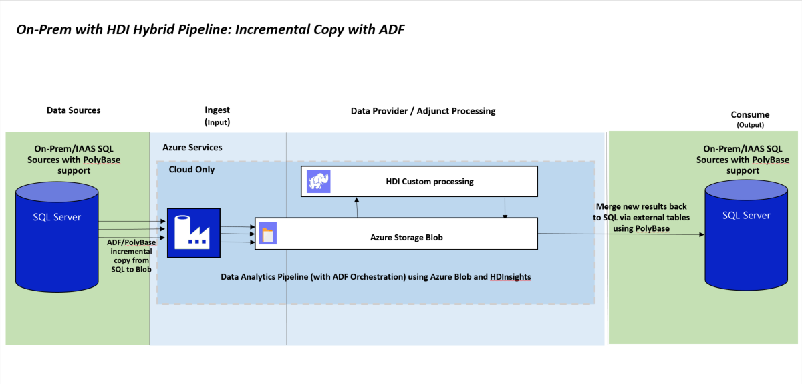

<properties
	pageTitle="Data Warehouse for Advanced Hybrid Analytics | Microsoft Azure"
	description="Data Warehouse for Advanced Hybrid Analytics."
	keywords="hdi, azure sql data warehouse, sql server 2016, polybase, jdbc, sparksql"
	services="sql-data-warehouse,sql-database,hdinsight,polybase,hadoop"
	documentationCenter=""
	authors="emawa"
	manager="roalexan"
	editor=""/>

<tags
	ms.service="sql-data-warehouse"
	ms.workload="data-services"
	ms.tgt_pltfrm="na"
	ms.devlang="na"
	ms.topic="article"
	ms.date="08/23/2016"
	ms.author="emawa" />

# Data Virtualization Patterns for Advanced Hybrid Analytics
A lot of companies now rely on data to make decisions that advance organizational growth, drive business decisions, generate profitability and so on. With the velocity of data generated from disparate sources, these companies' data have the potential of residing both on premises and in cloud
depending on the situations. There is a growing need to leverage a hybrid on-prem/cloud system for possible data congregation routes. 

The purpose of this tutorial is to discuss some identified use cases and solutions to achieve them using Microsoft Azure products.  

These identified patterns are not just recurring for various clients, but appears to be the growing business process trend. We've done some research and put together this tutorial that tries to cover these cases.

A few possible scenarios are:

- Systems on-premises marshal off large data computation to the cloud; results are sent back on-premises to applications dependent on this results.  

- The user may want to be closest to the largest source of data (locality of reference), probably relational, while integrating and referencing NoSQL data like click stream information to drive sales.  

- Leverage SQL knowledge both on-prem and in cloud on both relational and non-relational data.

- Avoiding low throughput on your data pipeline due to constant large data transfers

- Segregation and security of sensitive information on-prem while using the cloud for large crunching of other types of data.

- Avoid replication of business logic on multiple systems; save time, be more efficient, minimize latency and network I/O using incremental copying.

#### TAGS - Data Warehouse, HDInsight, Azure, Azure Blob Storage, SQL Server 2016, Azure IAAS, NoSQL, SQL On-Prem, SparkSQL  

## Scope and Prerequisites
This tutorial helps you create end-to-end (E2E) deployment ready pipelines for each use case. Each pipeline shows one
Azure Data virtualization capability using Azure products. For example SQL Data Sources (SQL Server 2016 (IAAS), Azure Data Warehouse), Azure Storage, PolyBase, and HDInsight.  

The tutorial will describe the overall approach through the following steps:  

1. ARM deployment of Azure Resources.  

1. Creating and loading of sample datasets.

1. Running SQL-like transactions either on On-Prem SQL Server 2016, SQL Data Warehouse and/or  Spark-Shell using SparkSQL depending 
on the given use case.


We assume the following prerequisites are fulfilled -  

1. An Active [Azure](https://azure.microsoft.com/) subscription.

1. Access to the latest [Azure PowerShell](http://aka.ms/webpi-azps) to run (CLI) commands 

## Use Cases
1. [Migrating data from On-Premises SQL sources to HDInsight external tables using PolyBase and Azure Blob](#migrating-sql-data-to-hdi-using-polybase-and-blob)
3. [Resource Deployment Walkthrough](#resource-deployment-walkthrough)
4. [Integrating data from Azure Blob with SQL-Like Systems via Polybase](#integrating-data-from-azure-blob-with-sql-via-polybase)
5. [Integrating data from SQL sources with HDInsight via SparkSQL](#integrating-data-from-sql-sources-with-hdinsight-using-sparksql)
6. [Integrating semi-structured data from On-Premises sources with HDInsight - Update and Merge into SQL DW](#integrating-semi-structured-data-from-on-premises-sources-with-sql-datawarehouse-using-hdinsight)

## Migrating SQL data to HDI using PolyBase and Blob
#### Use Case Summary

**MIGRATORY ROUTE FROM ON-PREMISES SQL SOURCES TO HDINSIGHT USING POLYBASE AND AZURE BLOB.**  

With the growth of data, clients will require a more robust workflow for ETL jobs. 
The option of migrating big data to cloud for this task is becomging very useful. 
Needless to say, applications that are dependent on on-prem infrastructure would need
 to still be supported, while the ETL is run in cloud. This use case covers a pattern of projecting data, using Polybase, to HDInsight clusters targetting external tables that are backed by Azure Blob.  

#### Benefit(s)  
- Delegation of time consuming processes/jobs to the cloud for parallelized computations. 

- Queries can be easily scaled out.  

- Sensitive data can be left On-Prem while the cloud be leveraged to work on less sensitive parts of the process flow.  

- A one-time PolyBase bulk push (INSERT) and Azure Data Factory (with PolyBase) can be used for incremental delta copies.

- Provide a very logical data migratory route while guaranteeing continous uptime for applications dependent on On-Prem data sources.  

#### Pipeline  
The architecture of this pattern can be broken down into two cases.  

1. **Initial Bulk Copy -** The entire data is projected one time using PolyBase to your HDInsight cluster using external tables. 
  

1. **Incremental Delta Data Copy -** Copy activity for modified rows or changes in data can be easily orchestrated using ADF with PolyBase support.  
 

#### Resource Deployment  
Clicking button below creates a new `blade` in Azure portal with the following resources deployed:

1. SQL Server 2016 (IAAS)  

1. A Four node HDInsight cluster - _two head nodes and two worker nodes_.

<a target="_blank" id="deploy-to-azure" href="https://portal.azure.com/#create/Microsoft.Template/uri/https%3A%2F%2Fbostondata.blob.core.windows.net%2Fedw-data-virtualization%2Fazuredeploy_UC1.json"></a>


#### Prerequisites  
The following PolyBase T-SQL objects are required. 

1. Database scoped credential 

1. External Data source  

1. External file format  

1. Blank external table on Azure Blob  


Earlier, in [Integrating data from Azure Blob with SQL-Like Systems via Polybase](#integrating-data-from-azure-blob-with-sql-via-polybase), we created objects that can be reused; database scoped credential, data source, and file format. We will need to create a new external table to hold data projected.  

>For detailed information on [Creating PolyBase T-SQL objects](https://msdn.microsoft.com/en-us/library/mt652315.aspx).

**Tables to migrate**  
1. Product table from AdventureWorks2012.

**Essential House keeping**  
> From SSMS, you may encounter the following error message while trying to export your tables. 
>
>  
>`Queries that reference external tables are not supported by the legacy cardinality estimation framework. Ensure that trace flag 9481 is not enabled, the database compatibility level is at least 120 and the legacy cardinality estimator is not explicitly enabled through a database scoped configuration setting.`  
>
> The following configurations must be set correctly. 
> 1. PolyBase must be allowed to export external tables.
> 1. The legacy compability estimation must be turned off.  
> 1. Your database compability level must be at least 120.


- Allow PolyBase to export external tables  
```
sp_configure 'allow polybase export', 1;
RECONFIGURE;
```

- Confirm legacy compability estimation is turned off.  
```
SELECT  name, value  
    FROM  sys.database_scoped_configurations  
    WHERE name = 'LEGACY_CARDINALITY_ESTIMATION';  
```

If set correctly, you would see  

  

- Check database compatibility level and alter to at least 120 if needed.  

Display all database levels
```
SELECT    d.name, d.compatibility_level  
    FROM  sys.databases AS d;
```

Alter level if needed, for my case I chose 130.

```
SELECT ServerProperty('ProductVersion');  
go  
  
ALTER DATABASE your_database_name  
    SET COMPATIBILITY_LEVEL = 130;  
go  
  
SELECT    d.name, d.compatibility_level  
    FROM  sys.databases AS d  
    WHERE d.name = 'your_database_name';  
go  

```

Outputs  

| name          | compability_level
| ------------- |:-------------:| 
| `your_database_name`| 130 | 
  


#### Create an external table and define table schema to hold data.

> **Important Note**  
The external table's schema definitions must match the schema of table we are trying to project. Decompose defined data types, like `FinishedGoodsFlag`, into its underlying data type `BIT`. 


##### Expand the `Columns` folder in SQL Server Management Studio (SSMS) to examine.   

  


##### Point External table to Blob container

 > **IMPORTANT**  
  > WASB must be able to find the Azure Storage account key in it's configuration. Using `SET` statement to provide a new secret key will not work. `CREATE TABLE` runs in the metastore service and has not visibility to the `SET` statements. Hence no runtime configuration changes will be used. 
  >
  > **Remedy -** Create extra containers in the Storage Account attached to the HDI Cluster and save any extra data. Easily achieve this using [Azure portal](https://portal.azure.com/signin/index/?cdnIndex=4&l=en.en-us) or [Azure Storage Explorer](http://storageexplorer.com/),


```
CREATE EXTERNAL TABLE Product(
	ProductID INT,
	Name NVARCHAR(50),
	ProductNumber nvarchar(25),
	MakeFlag BIT,
	FinishedGoodsFlag BIT,
	Color NVARCHAR(15),
	SafetyStockLevel smallint,
	ReorderPoint smallint,
	StandardCost money,
	ListPrice money,
	Size NVARCHAR(5) ,
	SizeUnitMeasureCode NCHAR(3) ,
	WeightUnitMeasureCode NCHAR(3),
	Weight decimal(8, 2),
	DaysToManufacture int,
	ProductLine NCHAR(2),
	Class NCHAR(2),
	Style NCHAR(2),
	ProductSubcategoryID int,
	ProductModelID int,
	SellStartDate datetime,
	SellEndDate datetime ,
	DiscontinuedDate datetime,
	rowguid NVARCHAR (255),
	ModifiedDate datetime
)
WITH (LOCATION='/product',
	  DATA_SOURCE = AzureStorage,
	  FILE_FORMAT = TextFileFormat
);
```

*Parameters:*  
1. **LOCATION:** Path to a file or directory that contains the actual data (this is relative to the blob container described earlier).  
	- To point to all files under the blob container, use **LOCATION='/'**  

##### Project and export data  
Move on-prem data to Azure blob using Polybase.  
`INSERT INTO dbo.Product SELECT * FROM AdventureWorks2012.Production.Product;`  

At this point, our data is exported sucessfully Azure Storage. It is easily accessible from HDI, for instance, using Hive or Spark query languages. Update and Merge can easily be achieved where HDI outputs to blob or other destinations.

##### Integrate exported data back to HDI  (Hive example) 
The exported data can now be loaded back to HDI for ETL, Update or Merge tasks.

```
CREATE DATABASE IF NOT EXISTS DATAANALYTICS;
CREATE EXTERNAL TABLE DATAANALYTICS.Product(
	ProductID INT,
	Name string,
	ProductNumber string,
	MakeFlag int,
	FinishedGoodsFlag int,
	Color string,
	SafetyStockLevel smallint,
	ReorderPoint smallint,
	StandardCost decimal(18, 2),
	ListPrice decimal(18, 2),
	Size string,
	SizeUnitMeasureCode string,
	WeightUnitMeasureCode string,
	Weight decimal(8, 2),
	DaysToManufacture int,
	ProductLine string,
	Class string,
	Style string,
	ProductSubcategoryID int,
	ProductModelID int,
	SellStartDate timestamp,
	SellEndDate timestamp ,
	DiscontinuedDate timestamp,
	rowguid string,
	ModifiedDate timestamp
)
ROW FORMAT DELIMITED FIELDS TERMINATED BY ',' 
LINES TERMINATED BY '\n'
STORED AS TEXTFILE LOCATION 'wasb://<container_name>@<storage_account_name>.blob.core.windows.net/product';
```  

See example above for an example where data residing on blob was integrated with SQL Datawarehouse. ([Integrating data from SQL sources with HDInsight via SparkSQL](#integrating-data-from-sql-sources-with-hdinsight-using-sparksql))  


