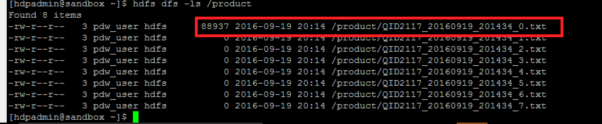

<properties
	pageTitle="Data Warehouse for Advanced Hybrid Analytics | Microsoft Azure"
	description="Data Warehouse for Advanced Hybrid Analytics."
	keywords="hdi, azure sql data warehouse, sql server 2016, polybase, jdbc, sparksql"
	services="sql-data-warehouse,sql-database,hdinsight,polybase,hadoop"
	documentationCenter=""
	authors="emawa"
	manager="roalexan"
	editor=""/>

<tags
	ms.service="sql-data-warehouse"
	ms.workload="data-services"
	ms.tgt_pltfrm="na"
	ms.devlang="na"
	ms.topic="article"
	ms.date="08/23/2016"
	ms.author="emawa" />

# Data Virtualization Patterns for Advanced Hybrid Analytics
A lot of companies now rely on data to make decisions that advance organizational growth, drive business decisions, generate profitability and so on. With the velocity of data generated from disparate sources, these companies' data have the potential of residing both on premises and in cloud
depending on the situations. There is a growing need to leverage a hybrid on-prem/cloud system for possible data congregation routes.

The purpose of this tutorial is to discuss some identified use cases and solutions to achieve them using Microsoft Azure products.  

These identified patterns are not just recurring for various clients, but appears to be the growing business process trend. We've done some research and put together this tutorial that tries to cover these cases.

A few possible scenarios are:

- Systems on-premises marshal off large data computation to the cloud; results are sent back on-premises to applications dependent on this results.  

- The user may want to be closest to the largest source of data (locality of reference), probably relational, while integrating and referencing NoSQL data like click stream information to drive sales.  

- Leverage SQL knowledge both on-prem and in cloud on both relational and non-relational data.

- Avoiding low throughput on your data pipeline due to constant large data transfers

- Segregation and security of sensitive information on-prem while using the cloud for large crunching of other types of data.

- Avoid replication of business logic on multiple systems; save time, be more efficient, minimize latency and network I/O using incremental copying.

#### TAGS - Data Warehouse, HDInsight, Azure, Azure Blob Storage, SQL Server 2016, Azure IAAS, NoSQL, SQL On-Prem, SparkSQL  

## Scope and Prerequisites
This tutorial helps you create end-to-end (E2E) deployment ready pipelines for each use case. Each pipeline shows one
Azure Data virtualization capability using Azure products. For example SQL Data Sources (SQL Server 2016 (IAAS), Azure Data Warehouse), Azure Storage, PolyBase, and HDInsight.  

The tutorial will describe the overall approach through the following steps:  

1. ARM deployment of Azure Resources.  

1. Creating and loading of sample datasets.

1. Running SQL-like transactions either on On-Prem SQL Server 2016, SQL Data Warehouse and/or  Spark-Shell using SparkSQL depending
on the given use case.


We assume the following prerequisites are fulfilled -  

1. An Active [Azure](https://azure.microsoft.com/) subscription.

1. Access to the latest [Azure PowerShell](http://aka.ms/webpi-azps) to run (CLI) commands  

## High Level Use Case(s) Architecture
1. Hybrid scenarios with On-Prem SQL Server 2016 and the following:
	- Hadoop Cluster for compute push down
	- HDInsight Spark/Hive Cluster for table projections.  

	  

2. Azure Cloud Only scenario with HDInsight Spark/Hive Cluster and Azure SQL DW.

	

## Table of Content
1. [Use Case 1 - Hybrid Data Analytics from On-Premises SQL Server to Cloud (HDInsight and Hadoop MapReduce) using PolyBase for query scale-out and processing.](#hybrid-onprem-sqlserver16-to-cloud-data-virtualization-using-polybase)

1. [Use Case 2 - Integrating Transactional NoSQL Data in HDInsight with Referential/Relational Data in SQL DW](#integrating-nosql-data-from-hdinsight-with-relational-data-on-sql-datawarehouse)

1. [Troubleshooting](Troubleshooting.md)

1. [Appendix](Appendix.md)


## Hybrid OnPrem SQLServer16 To Cloud Data Virtualization Using PolyBase
#### Use Case Summary

**INTEGRATING ON-PREMISES SQL SOURCES TO BIGDATA PLATFORMS LIKE HDINSIGHTS FOR PARALLELIZATION AND HADOOP FOR QUERY PUSH-DOWN.**  

With the growth of data, clients will require a more robust workflow for ETL jobs.
The option of migrating big data to cloud for this task is becoming very useful.
Needless to say, applications that are dependent on on-prem infrastructure would need
 to still be supported, while the ETL is run in cloud.   

PolyBase opens up a bigger opportunity for data processing and analytics.

- It provides integration between traditional SQL sources (SQL Server 2016, SQL DW, Parallel DW) and other big data platforms like Hadoop.  

-  With Standard SQL (as against MapReduce), customers can integrate Hadoop and relational data.

- Achieve query scale out and execution performance by predicate push-down to your already existing Hadoop clusters.

PolyBase support for transactional SQL (T-SQL) varies slightly on what SQL compute platform in question.   

For instance PolyBase does not support `UPDATE` and `DELETE` statements at the time of writing this. However, such `DML` actions can be achieved using `CREATE EXTERNAL AS SELECT`
on SQL DW and Parallel DW while on SQL Server 16 customers can achieve this by first creating an external table `CREATE EXTERNAL TABLE` (with schema definition) and then a separate `INSERT INTO TABLE AS SELECT` to populate the external table. Intermediate temporary tables need to be created and then `RENAME` command used to overwrite the old table.

> For details examples see [CTAS](https://msdn.microsoft.com/en-us/library/mt204041.aspx) and [CETAS](https://msdn.microsoft.com/en-us/library/mt631610.aspx) for SQL DW and Parallel DW examples.


#### Benefit(s)  
- Delegation of time consuming processes/jobs to the cloud for parallelized computations.

- Queries can be easily scaled out.  

- Sensitive data can be left On-Prem while the cloud be leveraged to work on less sensitive parts of the process flow.  

- A one-time PolyBase bulk push (INSERT) and Azure Data Factory (with PolyBase) can be used for incremental delta copies.

- Provide a very logical data migratory route while guaranteeing continuous uptime for applications dependent on On-Prem data sources.  

This use case covers the following patterns:   

1. Data projection to HDInsight clusters using Polybase; target external tables that are backed by Azure Blob.  

2. PolyBase query scale-out from SQL Server 16 to Hadoop MapReduce; query compute "predicate" push-down.

#### Data Projection Pipeline  
The architecture of this pattern can be broken down into two cases.  

1. **Initial Bulk Copy -** The entire data is projected one time using PolyBase to your HDInsight cluster using external tables.
  

1. **Incremental Delta Data Copy -** Copy activity for modified rows or changes in data can be easily orchestrated using ADF with PolyBase support.  


#### Resource Deployment  
Clicking button below creates a new `blade` in Azure portal with the following resources deployed:

1. One SQL Server 2016 with PolyBase support (IAAS)  

1. A four node HDInsight cluster - _two head nodes and two worker nodes_.

<a target="_blank" id="deploy-to-azure" href="https://portal.azure.com/#create/Microsoft.Template/uri/https%3A%2F%2Fbostondata.blob.core.windows.net%2Fedw-data-virtualization%2Fazuredeploy_UC1a.json"></a>

#### Extra manual deploy:
- **Reinstall PolyBase**  

	PolyBase will need to be re-installed on the SQL to start it on the SQL Server 2016. Find instructions in Appendix Page [here](Appendix.md#start-polybase-service-in-deployed-sql-server-2016).  

#### Data Source
1. Product table from AdventureWorks2012.

**Essential House keeping**  

- From Azure portal, get the connection details of the deployed SQL Server 2016.  

- Log on to the virtual machine using your favorite Remote Desktop Protocol (RDP) software.

- On the virtual machine, open **SQL Server Management Studio (SSMS).**  

- For authenticating to the SQL instance, use **Windows Authentication**.

> From SSMS, you may encounter the following error message while trying to export your tables.
>
>  
>`Queries that reference external tables are not supported by the legacy cardinality estimation framework. Ensure that trace flag 9481 is not enabled, the database compatibility level is at least 120 and the legacy cardinality estimator is not explicitly enabled through a database scoped configuration setting.`  
>
> The following configurations must be set correctly.
> 1. PolyBase must be allowed to export external tables.
> 1. The legacy compability estimation must be turned off.  
> 1. Your database compability level must be at least 120.


- Allow PolyBase to export external tables  
```
sp_configure 'allow polybase export', 1;
RECONFIGURE;
GO
```

- Confirm legacy compability estimation is turned off.  
```
SELECT  name, value  
    FROM  sys.database_scoped_configurations  
    WHERE name = 'LEGACY_CARDINALITY_ESTIMATION';  
```

If set correctly, you would see  

  

- Check database compatibility level and alter to at least 120 if needed.  

Display all database levels
```
SELECT    d.name, d.compatibility_level  
    FROM  sys.databases AS d;
```

Alter level if needed to 120.

```
SELECT ServerProperty('ProductVersion');  
GO  

ALTER DATABASE your_database_name  
    SET COMPATIBILITY_LEVEL = 120;  
GO  

SELECT    d.name, d.compatibility_level  
    FROM  sys.databases AS d  
    WHERE d.name = 'your_database_name';  
GO  

```

Outputs  

| name          | compability_level
| ------------- |:-------------:|
| `your_database_name`| 120 |


At this point, our SQL Server 2016 is ready to support PolyBase transactions.


### Required PolyBase Objects    
The following PolyBase T-SQL objects are required.

1. Database scoped credential

1. External Data source  

1. External file format  

1. External data source (i.e blank external table) that points to a directory on Azure Blob.

####  Create the T-SQL objects
Polybase can create objects that depend on either Hadoop or Azure Blob. For the purposes of this pattern, we will be creating our external data source that depends on the latter.
Connect to the AdventureWorks2012 database pre-loaded on the earlier created SQL Server 2016 and following instructions below.

**LINKS**  - You can interact with SQL Server 2016 via [Visual Studio](https://www.visualstudio.com/) or [Microsoft SQL Server Management Studio](https://msdn.microsoft.com/en-us/library/mt238290.aspx).  

- Create a master key on the database.  
This step is very important to encrypt the credential secret during network I/O transmission.

```
CREATE MASTER KEY ENCRYPTION BY PASSWORD = 'Us3@M0reS3cur3dP@ssw0rd!';
```

- Use master key to create a database scoped credential for our Azure blob storage.  
*Parameters:*  
    - **IDENTITY:** Any string identifier (not used for authentication). *Preferably use your storage name*.  
    - **SECRET:** Your Azure storage account key (can be found on [Azure Portal](portal.azure.com))

```
CREATE DATABASE SCOPED CREDENTIAL AzureStorageCredential
WITH IDENTITY = '<your_storage_name>', Secret = '<storage_account_access_key>';
```

- Create your external data source.

*Parameters:*
    - **LOCATION:**  Wasb path to Azure account storage account and blob container.  
    - **CREDENTIAL:** The database scoped credential we created earlier.

```
CREATE EXTERNAL DATA SOURCE AzureStorage WITH (
	TYPE = HADOOP,
	LOCATION = 'wasbs://<blob_container_name>@<azure_storage_account_name>.blob.core.windows.net',
	CREDENTIAL = AzureStorageCredential
);
```

- Create an file format for external source.  
In Polybase this is important to describe the format/structure of the input data.  
*Parameters:*  
    - **FORMAT TYPE:** Data format in Azure Blob. *Examples DELIMITEDTEXT,  RCFILE, ORC, PARQUET.*   

```
CREATE EXTERNAL FILE FORMAT TextFileFormat WITH (
	FORMAT_TYPE = DELIMITEDTEXT,
	FORMAT_OPTIONS (FIELD_TERMINATOR = ',', USE_TYPE_DEFAULT = TRUE)
);
```


#### Create an external table and define table schema to hold data.

> **Important Note**  
The external table's schema definitions must match the schema of table we are trying to project. Decompose defined data types, like `FinishedGoodsFlag`, into its underlying data type `BIT`.


##### Expand the `Columns` folder in SQL Server Management Studio (SSMS) to examine.   

  


##### Point External table to Blob container

 > **IMPORTANT**  
  > WASB must be able to find the Azure Storage account key in it's configuration. Using `SET` statement to provide a new secret key will not work. `CREATE TABLE` runs in the metastore service and has not visibility to the `SET` statements. Hence no runtime configuration changes will be used.
  >
  > **Remedy -** Create extra containers in the Storage Account attached to the HDI Cluster and save any extra data. Easily achieve this using [Azure portal](https://portal.azure.com/signin/index/?cdnIndex=4&l=en.en-us) or [Azure Storage Explorer](http://storageexplorer.com/),


```
CREATE EXTERNAL TABLE Product(
	ProductID INT,
	Name NVARCHAR(50),
	ProductNumber nvarchar(25),
	MakeFlag BIT,
	FinishedGoodsFlag BIT,
	Color NVARCHAR(15),
	SafetyStockLevel smallint,
	ReorderPoint smallint,
	StandardCost money,
	ListPrice money,
	Size NVARCHAR(5) ,
	SizeUnitMeasureCode NCHAR(3) ,
	WeightUnitMeasureCode NCHAR(3),
	Weight decimal(8, 2),
	DaysToManufacture int,
	ProductLine NCHAR(2),
	Class NCHAR(2),
	Style NCHAR(2),
	ProductSubcategoryID int,
	ProductModelID int,
	SellStartDate datetime,
	SellEndDate datetime ,
	DiscontinuedDate datetime,
	rowguid NVARCHAR (255),
	ModifiedDate datetime
)
WITH (LOCATION='/product',
	  DATA_SOURCE = AzureStorage,
	  FILE_FORMAT = TextFileFormat
);
```

*Parameters:*  
1. **LOCATION:** Path to a file or directory that contains the actual data (this is relative to the blob container described earlier).  
	- To point to all files under the blob container, use **LOCATION='/'**  

##### Project and export data  
Move on-prem data to Azure blob using Polybase.  
`INSERT INTO dbo.Product SELECT * FROM AdventureWorks2012.Production.Product;`  

At this point, our data is exported sucessfully Azure Storage. It is easily accessible from HDI, for instance, using Hive or Spark query languages. Update and Merge can easily be achieved where HDI outputs to blob or other destinations.

>For detailed information on [Creating PolyBase T-SQL objects](https://msdn.microsoft.com/en-us/library/mt652315.aspx).

##### Integrate exported data back to HDI  (Hive example)
The exported data can now be loaded back to HDI for ETL, Update or Merge tasks.

```
CREATE DATABASE IF NOT EXISTS DATAANALYTICS;
CREATE EXTERNAL TABLE DATAANALYTICS.Product(
	ProductID INT,
	Name string,
	ProductNumber string,
	MakeFlag int,
	FinishedGoodsFlag int,
	Color string,
	SafetyStockLevel smallint,
	ReorderPoint smallint,
	StandardCost decimal(18, 2),
	ListPrice decimal(18, 2),
	Size string,
	SizeUnitMeasureCode string,
	WeightUnitMeasureCode string,
	Weight decimal(8, 2),
	DaysToManufacture int,
	ProductLine string,
	Class string,
	Style string,
	ProductSubcategoryID int,
	ProductModelID int,
	SellStartDate timestamp,
	SellEndDate timestamp ,
	DiscontinuedDate timestamp,
	rowguid string,
	ModifiedDate timestamp
)
ROW FORMAT DELIMITED FIELDS TERMINATED BY ','
LINES TERMINATED BY '\n'
STORED AS TEXTFILE LOCATION 'wasb://<container_name>@<storage_account_name>.blob.core.windows.net/product';
```

> Specific Hive queries to be ran on
this table is beyond the scope of this tutorial.   

At this point, the `Product` external table is available to the HDInsight cluster for processing. Results from parallelized jobs (on the Product table)
can equally be saved back to the blob location, to be easily re-ingested back to the SQL Server 2016 using PolyBase, for instance.  

```
SELECT * FROM Product;
```   

#### Query Scale-out (Predicate Pushdown) Pipeline  
This pattern applies to SQL Server 2016 with PolyBase support and Hortonworks HDP 2.4 on Linux found on Azure market
place.    


  

#### Resource Deployment  

Divided into two stages.  
##### One Click deploy:  

Clicking button below creates a new `blade` in Azure portal with the following resources deployed:

1. One SQL Server 2016 with PolyBase support (IAAS)  

<a target="_blank" id="deploy-to-azure" href="https://portal.azure.com/#create/Microsoft.Template/uri/https%3A%2F%2Fbostondata.blob.core.windows.net%2Fedw-data-virtualization%2Fazuredeploy_UC1b.json"></a>

##### Extra manual deploy:
The following steps walks you through deploying an HDP Hadoop Sandbox (version 2.4 - current Azure market offering as at writing).

1. Reinstall PolyBase
PolyBase will need to be re-installed on the SQL to start it on the SQL Server 2016. Find instructions in Appendix Page [here](Appendix.md#start-polybase-service-in-deployed-sql-server-2016).  

2. Hadoop Cluster:  
This tutorial is written and tested with HortonWorks Hadoop. It assumes you have an already existing Hortonworks Hadoop cluster. Otherwise please find instructions on how to install a single node
HortonWorks cluster [here](HDP_Singlenode_Installation.md).

3. Set the essential Hadoop MapReduce and YARN configurations
For PolyBase connectivity, memory considerations need to be made for MapReduce and YARN.  Follow instructions
[here](HDP_Singlenode_Installation.md#hadoop-configuration-and-tuning-used-for-hdp-hadoop-vm) to set the needed flags and then return to continue.

#### Override PolyBase's Hadoop configurations with updated files.  
After setting the MapReduce and YARN flags, we should have downloaded the MapReduce Client files to your local machine.  
Unzip the downloaded config files. The MapReduce zip folder has the files of relevance (core-site.xml, mapred-site.xml, hdfs-site.xml)

PolyBase to Hadoop connectivity uses the following configuration levels (in the order).  

1. Hadoop Configuration folder in PolyBase installation folder on SQL Server.
1. Configurations set in Ambari  
1. Configurations set on the VM.

- To persist configurations, overwrite the variables in the PolyBase configuration folder. That way PolyBase uses this as primary.
	- Using your **RDP** application, log into the VM.  
	- On SQL Server 16, navigate to `C:\Program Files\Microsoft SQL Server\MSSQL13.MSSQLSERVER\MSSQL\Binn\Polybase\Hadoop\conf`  
	- Backup the following existing files  
		- `mapred-site.xml`  
	- Copy over the downloaded/updated versions (from Ambari configuration modifications). On your local machine, unzip the following zip files MAPREDUCE2_CLIENT-configs.tar.gz and YARN_CLIENT-configs.tar.gz.  
	Drill down to **MAPREDUCE2_CLIENT-configs.tar\var\lib\ambari-server\data\tmp\MAPREDUCE2_CLIENT-configs**.  
	Copy the `mapred-site.xml` from the MAPREDUCE2_CLIENT-configs, and replace the mapred-site.xml on the VM with it.  

	- Update `mapred-site.xml` for hdp.version, mapreduce split size and cross-platform (PolyBase on Windows to Hadoop possibly running on Linux).
	Open the VM version of `mapred-site.xml` and add the following.  

		```
		<property>
			<name>hdp.version</name>
			<value>2.4.3.0-227</value>
		</property>
		<property>
			<name>mapred.min.split.size</name>
			<value>1073741824</value>
		</property>
		<property>
			<name>mapreduce.app-submission.cross-platform</name>
			<value>true</value>
		</property>
		```  

		Find the current hdp version from the Linux HortonWorks VM by running `ls -la /usr/hdp/current/`. As at writing this, the current
		version is **2.4.3.0-227**

	- Restart SQL Server service.
		  

		Dependent services on the SQL Server will be restarted as well.
		  


##### Data Source
1. AdventureWorks2012.

**Essential House keeping**  

- From Azure portal, get the connection details of the deployed SQL Server 2016.  

- Log on to the virtual machine using your favorite Remote Desktop Protocol (RDP) software.

- On the virtual machine, open **SQL Server Management Studio (SSMS).**  

- For authenticating to the SQL instance, use **Windows Authentication**.

> From SSMS, you may encounter the following error message while trying to export your tables.
>
>  
> Queries that reference external tables are not supported by the legacy cardinality estimation framework. Ensure that trace flag 9481 is not enabled, the database compatibility level is at least 120 and the legacy cardinality estimator is not explicitly enabled through a database scoped configuration setting.  
>
> The following configurations must be set correctly.
> 1. PolyBase must be allowed to export external tables.
> 1. PolyBase to Hadoop connectivity must be set.
> 1. The legacy compability estimation must be turned off.  
> 1. Your database compability level must be at least 120.


- Allow PolyBase to export external tables  

```
sp_configure 'allow polybase export', 1;
RECONFIGURE;
GO
```

- Allow PolyBase to connect to Hadoop

```
-- Different values map to various external data sources.  
-- Example: value 7 stands for Azure blob storage and Hortonworks HDP 2.X on Linux/Windows.  

sp_configure @configname = 'hadoop connectivity', @configvalue = 7;   
RECONFIGURE ;  
GO   
```

- Confirm legacy compability estimation is turned off.  

```
SELECT  name, value  
    FROM  sys.database_scoped_configurations  
    WHERE name = 'LEGACY_CARDINALITY_ESTIMATION';  
```

If set correctly, you would see  

  

- Check database compatibility level and alter to at least 120 if needed.  

Display all database levels
```
SELECT    d.name, d.compatibility_level  
    FROM  sys.databases AS d;
```

Alter level if needed to 120.

```
SELECT ServerProperty('ProductVersion');  
GO  

ALTER DATABASE your_database_name  
    SET COMPATIBILITY_LEVEL = 120;  
GO  

SELECT    d.name, d.compatibility_level  
    FROM  sys.databases AS d  
    WHERE d.name = 'your_database_name';  
GO  

```

Outputs  

| name          | compability_level
| ------------- |:-------------:|
| `your_database_name`| 120 |


At this point, our SQL Server 2016 is ready to support PolyBase transactions.


### Required PolyBase Objects    
The following PolyBase T-SQL objects are required.

1. Database scoped credential

1. External Data source  

1. External file format  

1. External data source (i.e blank external table) that points to a directory on HDFS.

1. Statistics on external table.

> **IMPORTANT NOTE:**  
>
> **Creating Statistics on external tables is very important for PolyBase. This is how the query optimizer makes cost-based decisions on when to dynamically pushdown computation to Hadoop MapReduce.**  
>
>For detailed information on [Creating PolyBase T-SQL objects](https://msdn.microsoft.com/en-us/library/mt652315.aspx).

####  Create the T-SQL objects
Polybase can create objects that depend on either Hadoop or Azure Blob. For the purposes of this pattern, we will be creating our external data source that depends on Hadoop.
Connect to the AdventureWorks2012 database pre-loaded on the earlier created SQL Server 2016 and following instructions below.  

**LINKS**  - You can interact with SQL Server 2016 via [Visual Studio](https://www.visualstudio.com/) or [Microsoft SQL Server Management Studio](https://msdn.microsoft.com/en-us/library/mt238290.aspx).  

- Create a master key on the AdventureWorks2012 database.  
This step is very important to encrypt the credential secret during network I/O transmission.

```
CREATE MASTER KEY ENCRYPTION BY PASSWORD = 'Us3@M0reS3cur3dP@ssw0rd!';
```

- Use master key to create a database scoped credential for your hdfs connectivity.  
*Parameters:*  
    - **IDENTITY:** Hadoop Kerberos user with read, write, execute permissions
    on the HDFS directory.
    - **SECRET:** Hadoop Kerberos password for user specied in **IDENTITY** above

```
CREATE DATABASE SCOPED CREDENTIAL HadoopStorageCredential
WITH IDENTITY = '<your_hadoop_user>', Secret = '<hadoop_user_password>';
```

- Create your external data source.  
*Parameters:*  
	- **LOCATION:**  Hadoop NameNode Private IP address and port. (8020 for HDP 2.X). Get this information from Azure Portal.
    - **RESOURCE MANAGER LOCATION ** Hadoop Resource Manager location to enable pushdown computation. (Use port 8050 for HDP 2.X)  
    - **CREDENTIAL:** The database scoped credential we created earlier.

```
CREATE EXTERNAL DATA SOURCE MyHadoopCluster WITH (  
        TYPE = HADOOP,   
        LOCATION ='hdfs://<namenode_private_ip_address>:8020',   
        RESOURCE_MANAGER_LOCATION = '<resource_manager_private_ip:8050',   
        CREDENTIAL = HadoopStorageCredential      
);  
```

- Create an file format for external source.  
In Polybase this is important to describe the format/structure of the input data.  
*Parameters:*  
    - **FORMAT TYPE:** Data format in Hadoop. *Examples DELIMITEDTEXT,  RCFILE, ORC, PARQUET.*   

```
CREATE EXTERNAL FILE FORMAT TextFileFormat WITH (
	FORMAT_TYPE = DELIMITEDTEXT,
	FORMAT_OPTIONS (FIELD_TERMINATOR = '|',
	USE_TYPE_DEFAULT = TRUE)
);
```

- Create an external table and define table schema.

> **Important Note**  
The external table's schema definitions must match the schema of table we are trying to project. Remember to decompose defined data types, like `FinishedGoodsFlag`, into its underlying data type `BIT`.


###### Expand the `Columns` folder in SQL Server Management Studio (SSMS) to examine.   

  


###### Point External table to a directory in Hadoop.

```
CREATE EXTERNAL TABLE Product_HDFS (
	ProductID INT,
	Name NVARCHAR(50),
	ProductNumber nvarchar(25),
	MakeFlag BIT,
	FinishedGoodsFlag BIT,
	Color NVARCHAR(15),
	SafetyStockLevel smallint,
	ReorderPoint smallint,
	StandardCost money,
	ListPrice money,
	Size NVARCHAR(5) ,
	SizeUnitMeasureCode NCHAR(3) ,
	WeightUnitMeasureCode NCHAR(3),
	Weight decimal(8, 2),
	DaysToManufacture int,
	ProductLine NCHAR(2),
	Class NCHAR(2),
	Style NCHAR(2),
	ProductSubcategoryID int,
	ProductModelID int,
	SellStartDate datetime,
	SellEndDate datetime ,
	DiscontinuedDate datetime,
	rowguid NVARCHAR (255),
	ModifiedDate datetime
)
WITH (LOCATION='/product',
	  DATA_SOURCE = MyHadoopCluster,
	  FILE_FORMAT = TextFileFormat
);
```

*Parameters:*  
1. **LOCATION:** Path to a file or directory that contains the actual data (this is relative to hdfs root directory).   

A quick confirmation is seen with a **SELECT**

```
SELECT * FROM dbo.Product;
```


###### Project and export data  
For this pattern, we will assume product related ETL is performed on Hadoop. This ETL generates a **Product** table that is needed also in SQL Server ETL. We will project sample data to simulate this from AdventureWorks2012 Product table.

To export on-prem data to HDFS using Polybase.  

`INSERT INTO dbo.Product_HDFS SELECT * FROM AdventureWorks2012.Production.Product;`  

> **NOTE**  
> This can also be used for a **One-time BULK Copy** when migrating data to HDFS from SQL Server 2016.  

At this point, our data is exported successfully to HDFS. PolyBase exports multiple files that may or may not contain data.




###### Query scale out example to Hadoop MapReduce  
Predicate pushdown can improve query performance; if a user writes a query that selects a subset of rows from an external table.

PolyBase from SQL Server 2016 initiates a MapReduce job to retrieve only the rows that match the predicate ProductID > 50 on Hadoop. As the query can execute completely without scanning all rows, the MapReduce only the returns rows that meet the predicate criteria back to the SQL Server.

###### Benefits  
1. Significant save on execution time; especially for very large table.  

1. Less temporary storage space is used by the PolyBase process for unnecessary rows. This can increase exponentially with the table size.

```
SELECT p.ProductID AS ProductID, p.Name AS ProducName, p.ProductLine as ProductLine, p.SafetyStockLevel AS SafetyStockLevel, p.SellStartDate as SellStartDate, p.SellEndDate as SellEndDate, ((sod.OrderQty * sod.UnitPrice) * (1.0 - sod.UnitPriceDiscount)) as TotalSalesAmt
FROM dbo.Product_HDFS AS p
RIGHT JOIN AdventureWorks2012.Sales.SalesOrderDetail AS sod
ON p.ProductID = sod.ProductID
WHERE p.ProductID > 50
ORDER BY p.ProductID ASC OPTION (FORCE EXTERNALPUSHDOWN);
```

- Map Reduce UI  
	

	

- Execution time Summary:
	- PolyBase records ~19 seconds total round trip time.
		- ~16 seconds for MapReduce including cold start. This can be optimized further with Hadoop tuning.

	


## Integrating NoSQL Data From HDInsight With Relational Data on SQL Datawarehouse

## Use Case Summary   
**INTEGRATING TRANSACTIONAL NoSQL DATA WITH REFERENTIAL/RELATIONAL DATA FROM SQL DW ON HDInsight**

Currently, integrating data residing on On-Prem Hadoop systems with Azure compute platforms, like SQL Data Warehouse, is not a trivial process.  

In order to get better end-to-end throughput, an intermediate copy to blob would be needed; using **PolyBase and Azure Data Factory StagedCopy**. Azure Data Factory is able to apply transformations that match PolyBase/SQL source requirements.  

>Check out [Staged Copy using PolyBase](https://azure.microsoft.com/en-us/documentation/articles/data-factory-azure-sql-data-warehouse-connector/#staged-copy-using-polybase) for further details.  

This workflow, although offers a way to virtualize data on-prem and in cloud, focuses more on data copy and not integration nor harmonization. This can easily get expensive in terms of resources (for staged copy), security concerns (additional step to encrypt) and so on.   

Our tutorial tries to focus on harmonization processes and routes, hence we will achieve the update and merge using Hadoop sources in Azure.  


#### Use Case Overview
Let us assume a scenario can exist where all sales information and transactions are sensitive and need to be kept protected on a SQL data source. Now an ETL that creates inventory and profit projections/visualizations on Power BI may need NoSQL product data residing on Azure Data Lake Store (ADLS) and historical sales data. This becomes a bit tricky due to the disparate source of data and the complex computation to generate this. The Historical ETL can only run on SQL DW (due to the location of the sales data) and NoSQL product data transactions run close to ADLS. We need to figure out an intelligent approach of virtualizing this scenario without increasing resource overhead and network I/O.   

To solve this and show case the power of this use case, we can demonstrate how a complex query can be constructed at the SQL Data Warehouse side (for the sales data) and without materializing the generated tables leverage parallelized in-memory computation of Spark to bring in the NoSQL product data.  

#### Benefit(s)  
- Click stream (NoSQL) data, like real-time information, can be combined with referential (SQL) data, like products in stock, to decide
how to control inventory of products for profitability and business intelligence.

- Queries can be scaled out and parallelized using Hive, HBase or Spark.  

- HDInsight, out of the box, supports connectivity to relational data sources via `JDBC`. Using Views, complex joins can be
materialized on SQL Datawarehouse and results pulled into Spark for further processing.

- Complex joins can be done between Facts and Dimensions, allowing easier Update and Merge operations.

#### Pipeline  
  

#### Resource Deployment    
This use case requires the following resources.
1. One Azure SQL Data Warehouse
1. One HDInsight cluster
1. One Azure Data Lake Store
1. One Service Principle Identity (SPI)
1. One certificate for access control  

##### One Click Deployment  
Clicking button below creates a new `blade` in Azure portal with the following resource(s) deployed:

- One Azure SQL Data Warehouse  

<a target="_blank" id="deploy-to-azure" href="https://portal.azure.com/#create/Microsoft.Template/uri/https%3A%2F%2Fbostondata.blob.core.windows.net%2Fedw-data-virtualization%2Fazuredeploy_UC2a.json"></a>


##### Manual Deployment  

###### HDI Cluster and Azure Data Lake Store (ADLS) Authentication and Connectivity.  
- **Authentication:** A certified identity is required in Azure Active Directory (AAD).   

- **Connectivity:** ADLS exposes a web-based RESTful interface to allows calls to be made.   
	- Calls need to be made with a JSON Web Token (JWT) that is obtained for identity from AAD.

- **Service Principle Identity (SPI):**  A headless user in the AAD that is associated with a certificate.  

- **Credential Creation:** During the creation of the HDI Cluster, a SPI (and its certificate) is created in AAD and stored in the cluster.

- **Runtime Processing:** At runtime, the web-credential is used for the interaction. The associated web-token is passed to AAD which exchanges it with a JWT. The JWT is used to make the actual calls.

- **Data Access:** Different users can interact with the ADLS using the same SPI. Hence the SPI needs access to your data.
	- Data is read and written by the SPI.

If you have created a SPI and certificate before, it can be reused here, otherwise one can be created quickly and automatically during the HDInsight creation.


#### Deploy a Spark HDInsight Cluster with Azure Data Lake Store as secondary storage from Portal
The following will be covered in this part of the tutorial:  

1. Creating an Azure Data Lake Store.  

1. Create a Service Principal Identity and Certificate.  

1. Create an HDInsight Cluster in **R Server (Preview)** mode, for access to ADLS SDK support in Spark.


The SPI and Certificate can be created using PowerShell Commands, instructions can be found [here](Appendix.md#create-the-certificate-and-service-principal-identity) or Azure Portal, which is our **RECOMMENDED** approach.


> IMPORTANT NOTE   
> **Following the tutorial below walks you through how to create an Hadoop HDInsight cluster with ADLS support. Please select the R Server (Preview) version instead of Hadoop. This cluster will include all HDInsight applications like Hive, Hadoop, HBase, and Spark**  
> During the cluster creation, under **CREDENTIALS**, make a new SPI and Certificate.  

Follow instructions here on how to [Create an HDInsight cluster with Data Lake Store using Azure Portal](https://azure.microsoft.com/en-us/documentation/articles/data-lake-store-hdinsight-hadoop-use-portal/).  


#### Manually load AdventureWorks sample data.  
Follow link to load [Sample data into the deployed SQL Data Warehouse](https://azure.microsoft.com/en-us/documentation/articles/sql-data-warehouse-load-sample-databases/).  


#### Data Source
1. **AdventureWorks** Dataset (Loaded manually above)

##### Generate Referential Data in SQL Data Warehouse
Generate a historical **VIEW** of our sales data until last year.  

```
-- Creating Historical Sales Data as View (ie, Avoid materializing the results)
CREATE VIEW SalesFromPastYears
AS
SELECT
    [SalesOrderNumber]
    ,[SalesOrderLineNumber]
    ,p.EnglishProductName as ProductName
    ,st.SalesTerritoryCountry
    ,[OrderQuantity]
    ,[UnitPrice]
    ,[ExtendedAmount]
    ,[SalesAmount]
    ,(convert(date, CAST(OrderDateKey as varchar))) AS [OrderDate]
FROM [dbo].[FactInternetSales] a
inner join dbo.DimProduct p on a.ProductKey = p.ProductKey
inner join dbo.DimSalesTerritory st
on st.SalesTerritoryKey = a.SalesTerritoryKey
where year(convert(date, CAST(OrderDateKey as varchar))) < 2015
```

Creating this `VIEW` does not materialize the table as it may be very large and slow computation on SQL Data Warehouse. The result of this complex query is only materialized at execution time from Spark. This workflow begins to demonstrate how we can leverage the parallelized in-memory computation scenarios that combines the storage power of SQL Data Warehouse and the speed of Spark.


#### Start the spark shell pointing to the JDBC connector.  
With the JDBC defined variables, connect and load data from the SQL DW table.  

  **NOTE:** All JDBC jar files are available on HDI Clusters by default at **/usr/hdp/<version_of_hdp_number>/hive/lib/**  

```
$SPARK_HOME/bin/spark-shell --jars  /usr/hdp/current/hive-server2/lib/sqljdbc4.jar
```

If Spark shell loads successfully, we can now connect to the SQL DW Table **FactInternetSale** and read the table.  
The following Scala code defines connection variables to an Azure SQL Data Warehouse table and connects to the external table; making it available for querying.    

```
scala> val url = "jdbc:sqlserver://<yoursqllogicalserver>.database.windows.net:1433;database=<db_name>;user=<user_name>@<my_sqllogical_server_name>;password=<your_password>"  
```

```
scala> val driver = "com.microsoft.sqlserver.jdbc.SQLServerDriver"  
```

**NOTE**  
Since our exercise implements a hybrid query harmonization between SQL DW and NoSQL, we will use the hiveContext. This will give us the SparkSQL commands and also Hive functionalities that will
let use perform joins. We need to do this because temporary tables are registered in-memory and attached to a specific SQLContext.

#### Construct a HiveContext (with SQL implicit commands) and fetch data from SQL DW.

- Import HiveContext package

```
scala> import org.apache.spark.sql.hive.HiveContext

```

- Construct a HiveContext and attach to existing Spark context.  

  In order to work with Hive from Spark, you must construct a HiveContext.  

  **NOTE** -  HiveContext inherits from SQLContext and also benefits from all SQL commands available from SQLContext. It is still possible to create a HiveContext without a Hive deployment. For details visit [Spark SQL Docs](http://spark.apache.org/docs/latest/sql-programming-guide.html)  

```
scala> val hiveContext = new org.apache.spark.sql.hive.HiveContext(sc)
```

```
scala> import hiveContext.implicits._
```

- Fetch Historical Sales data from SQL Data Warehouse
Right now we can materialize a **VIEW** of our  Historical Sales and pull it in like a regular SQL table using SparkSQL.  

> IMPORTANT NOTE  
> **dbo.SalesFromPastYears** is a **VIEW** (not a TABLE) on SQL Data Warehouse side.  


```
scala>  val table = "(SELECT * FROM dbo.SalesFromPastYears) AS HistoricalSales"
```

Now fetch data.  

```
scala> val dwHistoricalSales = hiveContext.read.format("jdbc").option("url", url).option("driver", driver).option("dbtable", table).load()
```


To confirm a success connection, we should get a description of the columns of the table **HistoricalSales** as a **dataframe** `dwHistoricalSales`

> dwHistoricalSales: org.apache.spark.sql.DataFrame = [SalesOrderNumber: string, SalesOrderLineNumber: int, ProductName: string, SalesTerritoryCountry: string, OrderQuantity: int, UnitPrice: decimal(19,4), ExtendedAmount: decimal(19,4), SalesAmount: decimal(19,4), OrderDate: date]


You can view the data in `dwHistoricalSales` by a call to action `.show`. This will display the **top 20 rows** by fetching results from the executors back to the driver node.


  ```
  scala> dwHistoricalSales.show
  ```

  To view the dataframe schema.  

  ```
  scala> dwHistoricalSales.printSchema
  ```

  You should a similar output as the following:  

  >root
  	|-- SalesOrderNumber: string (nullable = false)  
   	|-- SalesOrderLineNumber: integer (nullable = false)  
   	|-- ProductName: string (nullable = false)  
   	|-- SalesTerritoryCountry: string (nullable = false)  
   	|-- OrderQuantity: integer (nullable = false)  
   	|-- UnitPrice: decimal(19,4) (nullable = false)  
   	|-- ExtendedAmount: decimal(19,4) (nullable = false)  
   	|-- SalesAmount: decimal(19,4) (nullable = false)  
   	|-- OrderDate: date (nullable = true)  


  Now we will register our dataframe as a table in our SQLContext i.e. making it queriable like another relational table  
  ```
  scala> dwHistoricalSales.registerTempTable("DWTableHistoricalSales")
  ```

  We now have a queriable SQL Data Warehouse table from a Spark SQLContextSQL. Table is registered as a temporary table and has all SQL commands available to SQLContext.  
  To verify the data, a quick select will show this.  

  ```
  scala>  hiveContext.sql("SELECT * FROM DWTableHistoricalSales LIMIT 10").show
  ```

  Next we want to pull our product NoSQL data from Azure Data Lake Store (ADLS) to perform adhoc queries.

  - Fetch NoSQL Product Data from ADLS via HiveContext

  Spark gets Hive for free using the HiveContext. To work with Hive (our NoSQL data is imported using a HiveContext), we must create a HiveContext.   

  > IMPORTANT NOTE  
  > Let us assume that another ETL runs in cloud and produces NoSQL Product data into ADLS. The final ETL may need a hybrid scenario that combines historical sales data from SQL Data Warehouse and NoSQL Product data on ADLS.  

  - Copy sample data to ADLS Upload [this](./assets/data/DimProduct.json) sample data (**DimProduct** table in JSON format) to ADLS by following instructions from [here!](https://azure.microsoft.com/en-us/documentation/articles/data-lake-store-get-started-portal/#uploaddata)

  ```
  scala>  val adlsProductData = hiveContext.jsonFile("adl://<your_adls_store_name>.azuredatalakestore.net/<path_to_your_adls_folder>/DimProduct.json")
  ```

  To confirm a sucessful load, print the `adlsProductData` schema.

  ```
  scala> adlsProductData.printSchema
  ```

  >root  
 |-- Class: string (nullable = true)  
 |-- Color: string (nullable = true)  
 |-- DaysToManufacture: string (nullable = true)  
 |-- DealerPrice: string (nullable = true)  
 |-- EndDate: string (nullable = true)  
 |-- EnglishDescription: string (nullable = true)  
 |-- EnglishProductName: string (nullable = true)  
 |-- FinishedGoodsFlag: string (nullable = true)  
 |-- ListPrice: string (nullable = true)  
 |-- ModelName: string (nullable = true)  
 |-- ProductAlternateKey: string (nullable = true)  
 |-- ProductKey: string (nullable = true)  
 |-- ProductLine: string (nullable = true)  
 |-- ProductSubcategoryKey: string (nullable = true)  
 |-- ReorderPoint: string (nullable = true)  
 |-- SafetyStockLevel: string (nullable = true)  
 |-- Size: string (nullable = true)  
 |-- SizeRange: string (nullable = true)
   |-- SizeUnitMeasureCode: string (nullable = tru  e)
 |-- StandardCost: string (nullable = true  )
 |-- StartDate: string (nullable = true)  
 |-- Status: string (nullable = true)  
 |-- Style: string (nullable = true)  
 |-- Weight: string (nullable = true)  
 |-- WeightUnitMeasureCode: string (nullable = true)  


  ```
  scala> adlsProductData.registerTempTable("ADLSProductTable")
  ```

  #### Perform ad-hoc complex query between SQL DW Table and ADLS external table  
  At this point, we have referential historical sales data that is generated by a process on SQL DW and NoSQL product table that is consumed from Azure Data Lake Store, both registered in-memory on the Spark executors.  

  This creates a powerful hybrid scenario. We can easily see how both storage and compute can scale in parallel. This isolates systems, making it manageable.

  Using the HiveContext, performing ad-hoc queries like JOINS becomes trivial.

  - Join tables

  ```
   val historicalSalesInformation = hiveContext.sql("SELECT  a.*, b.EnglishProductName as ProductName  FROM DWTableHistoricalSales a INNER JOIN ADLSProductTable b ON a.ProductKey = b.ProductKey")
  ```

  `historicalSalesInformation` is a dataframe (formerly SchemaRDD) that we can view, manipulate and export.

  - View output result.

  ```
  scala> historicalSalesInformation.show
  ```  

  The results from this pattern can be used in other pipelines or exported for visualization in tools like Power BI.
