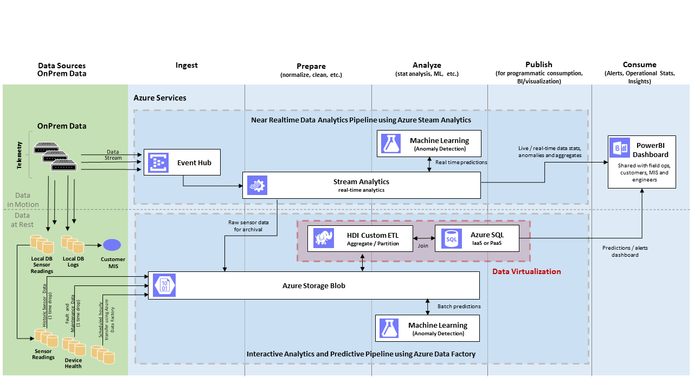
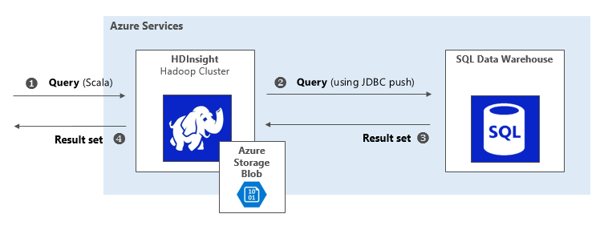

# Data Virtualization Tutorial Using SQL Server 2016 and HDInsight

## Table of Contents

- [Scope](#scope)
- [Pre-requisites](#pre-requisites)
- [Data Virtualization – Definition and Benefits](#data-virtualization-definition-and-benefits)
- [Data Virtualization Architectures](#data-virtualization-architectures)
- [Query Scale-out Architecture](#query-scale-out-architecture)
- [Hybrid Execution Architecture](#hybrid-execution-architecture)
- [Deployment](#deployment)
- [Run-time Usage](#run-time-usage)
	- [Query Scale-out](#query-scale-out)
	- [Hybrid Execution](#hybrid-execution)
- [Exit and Clean up](#exit-and-clean-up)

## Scope
In this tutorial, we will describe the architecture and benefits of data virtualization using two techniques:

1. Query Scale-out  
1. Hybrid Execution

The tutorial will guide you to implement and examine these techniques on the Microsoft Azure stack. The steps are as follows:

1. Deploy Azure resources.
1. Create and load sample datasets.
1. Run SQL-like transactions on SQL Server 2016 or Spark SQL on HDInsight cluster.

## Pre-requisites

To deploy data virtualization using this tutorial you’ll need an active [Azure subscription](http://portal.azure.com).

## Data Virtualization – Definition and Benefits

Machine and deep learning rely heavily on large data sets - both historical and across various business functions (sales, marketing, human resources etc.).

This big data (usually collected over a large period) are often stored in various heterogenous systems, making it hard to access the data without having to move it physically.

Also in big data platforms as the demand to crunch data increases, we run into resource constrained environments. That’s when the needs to offload computation to more powerful processing systems becomes critical.

Data virtualization addresses these scenarios by giving you tools to abstract data access. It allows you to manage and work with data across various systems, regardless of their physical location or the format of each data source.

As such, data virtualization can be defined as a set of tools, techniques, and methods to access and interact with data without worrying about its physical location and what compute is done on it.

In a big data environment, data virtualization offers several benefits as summarized below:

- Offload large computation to more powerful processing systems and seamlessly merge the results.
- Access large collections of disparate data sources across system boundaries (example: distinct systems for marketing and sales data).
- Enable queries against large datasets without the need to move them to a single system (potentially with limited storage).
- Reduce heavy network I/O by moving compute to the data.
- Simplify access to all sorts of data using a single query language (example: SQL).
- Avoid the need to replicate business logic across multiple systems.
- Integrate cloud-based compute with corporate datacenter environments.

## Data Virtualization Architectures

Data virtualization can be illustrated using Azure’s lambda architecture diagram:

**Figure 1: Data virtualization in Azure’s lambda architecture**

In big data processing platforms, a lot of data gets ingested per second. This includes both data in rest and in motion. This big data is then collected in canonical data stores (e.g. Azure storage blob) and subsequently cleaned, partitioned, aggregated and prepared for downstream processing.

Examples of downstream processing includes advanced analytics machine learning, visualization, dashboard report generation etc.

This downstream processing is backed by SQL servers, which can get overloaded when many queries are executed in parallel by competing services.

To address such overload scenarios, data virtualization provides a technique called **Query Scale-out** where part of the compute is offloaded to more powerful systems like Hadoop clusters.

Another scenario shown in figure 1 involves ETL processes running in the HDInsight clusters. ETL transform may need access to referential data stored in the SQL servers.

Data virtualization offers a technique called **Hybrid Execution** which allows you to query referential data from remote stores, such as SQL servers.

We will now discuss each of these data virtualization techniques in detail. Later in the document we will walk through the steps to implement and examine these techniques.

## Query Scale-out Architecture

Say you have a multi-tenant SQL Server running on a hardware constrained environment. You want to offload some of the compute to speed up the queries. You also want to access the big data that won't fit in the SQL Server.

In such cases, data virtualization technique called Query Scale-out can be used.

Query Scale-out uses [PolyBase](https://msdn.microsoft.com/en-us/library/mt143171.aspx) technology introduced in SQL Server 2016. PolyBase allows you to execute part of a query remotely on a faster, higher capacity big data system, such as Hadoop clusters.

### Example:

In figure 1, The up-stream HDInsight cluster runs analytics workloads (Extract Transform and Load) and loads the data in the SQL server periodically. As such the cluster contains entire sets of historic data while the SQL server contains the most recent slice of data.

So, if we consider a SQL query that joins columns across several large tables in a relational database, and if that query could be deconstructed such that part of the compute runs in the database and part of it runs remotely in the Hadoop cluster, then this can speed up execution.

This is exactly what happens in Query Scale-out. Using PolyBase, we use such a SQL query in which the 'where' clause is remotely executed on an up-stream Hadoop cluster.

When the SQL server tries to push the 'where’ clause execution to the up-stream Hadoop cluster, the cluster executes the query using its historic data archive and returns a result back to the database. This result is then incorporated back into the local query execution.

In the deployment section later in this document, we will walk through the steps to implement Query Scale-out and examine how it improves computational performance.

**Figure 2: System-level illustration of Query Scale-out**

### Benefits

- Run queries against very large datasets. This is very useful in case of resource constrained data repositories.
- Faster overall execution time.
- Lower network I/O.

## Hybrid Execution Architecture

Say you have ETL processes that run over your unstructured data and store it in blob. You need to join this blob data with referential data stored in a relational database. How would you uniformly access data in these distinct data sources?

In such cases, data virtualization technique called Hybrid Execution can be used.

Hybrid Execution allows you to "push" query to a remote system, such as a SQL server, to access the referential data.

### Example

In figure 1, let us consider an ETL process that runs in the HDInsight cluster. Say a series of this ETL does some processing on the unstructured data, stores it into blob, and needs to join it with referential data stored in a relational system (e.g. a remote SQL database downstream).

Using JDBC, Hybrid Execution enables you to run a query from an HDI environment that joins data in the Azure SQL Data Warehouse with data in the Azure storage blob.

In the deployment section later in this document, we will walk through the steps to implement Hybrid Execution and examine how to push a query from Hadoop to a SQL database using JDBC.

**Figure 3: System-level illustration of Hybrid Execution**

### Benefits

- Unified access to referential  data from Hadoop systems.
- Access to remotely stored data without requiring.

## Deployment

### Environment setup

We are now ready to deploy data virtualization use cases in the Azure stack.

You’ll be asked to provide a few input parameters, after that the following Azure resources will be automatically created:

- HDInsight cluster

	A Hadoop cluster running on Azure. It computes a portion of the SQL query in case of Query-Scale out. It also hosts the Jupyter notebook used to join data in Azure blob store with relational table data in case of Hybrid Execution.

- Virtual machine

	A virtual machine hosting SQL Server 2016 (which is required for PolyBase) used in case of Query Scale-out.

- Public IP address

	The public static IP address is automatically created when you create the virtual machine. The VM is used to run Query Scale-out.

- Network interface

	The network interface is automatically created by the HDInsight cluster and used in both cases.

-	Network security group

	The network security group is automatically created by the HDInsight cluster and used by both cases.

-	Virtual Network

	The virtual network is automatically created by the HDInsight cluster and used in both use cases.

-	Storage account

	The storage account is automatically created to be used by the HDInsight cluster as its primary backing store. This account is used in both cases.

- Load balancer

	The load balancer automatically is created by the HDInsight cluster. It is used in both techniques for high availability e.g. as in the case of two head nodes in the cluster.

- SQL Server

	The logical SQL Server contains the SQL Data Warehouse, which is used in case of Hybrid Execution.

- SQL Data Warehouse

	The SQL Data Warehouse contains referential table data. It is used in case of Hybrid Execution.

As part of the deployment, the virtual machine will invoke a custom script extension to:

- Install the JRE

	The Java Runtime Environment (JRE) is required by PolyBase.

- Install PolyBase

	PolyBase is a technology that works with SQL Server 2016 to access data stored in HDInsight clusters or Azure storage blobs.

- Create AdventureWorks2012 on the local SQL Server 2016

	AdventureWorks is a sample database typically deployed on SQL Server.

- Populate AdventureWorksDW2012 on the Azure SQL Data Warehouse

	AdventureWorksDW2012 is a sample database typically deployed on SQL Data Warehouse.

After the resources are provisioned, the deployment instructions will walk you through a few manual steps to fully configure and hydrate the end to end solution.

To kick-start the deployment, click on this [link](https://gallery.cortanaintelligence.com/Tutorial/Data-Virtualization-Techniques-Using-SQL-Server-2016-and-HDInsight).

The entire process takes about 30 minutes.

## Run-time Usage

When everything is deployed, you're ready to examine the two data virtualization techniques:

- Query Scale-out
- Hybrid Execution

### Query Scale-out

In this section, we will examine how your query executes much faster when part of the SQL query executes in a remote Hadoop cluster.

To setup the demo, we deploy

- A virtual machine (as an IaaS service)
- SQL Server 2016 (in the VM)
- PolyBase (in the SQL Server)
- AdventureWorks as sample OLTP database

#### Step-1: Run on local resources only

In the first leg of the demo, we are going to look at the case where the entire query runs in your SQL Server. To do this, follow the steps below:
1. Using your existing client session to your virtual machine, double click **SQL - Data Virtualization** on your desktop.
1. It will bring up sample SQL folder in Explorer.
1. Open the file **select-without-pushdown.sql**

Note: You can also access the scripts from the [repo directory](https://github.com/Azure/cortana-intelligence-dw-advanced-hybrid-analytics/tree/master/scripts/sql-server/sql).

AdventureWorks has a custom table named BigProduct with 40 million rows and we will execute the following query to join the table data.

~~~~
...
FROM
  Production.BigProduct p
...
WHERE
  p.ProductID > 50
ORDER BY
  p.ProductID;
~~~~

This query executes entirely on the SQL Server running on your virtual machine.

Note that for the purposes of this tutorial we allow the sample query to run on the SQL Server without adding any extra load nor do we execute any other query in parallel.

However, in production environments usually multiple queries run in parallel competing for memory, CPU, I/O. This further deteriorates query performance. In a big data context, it is also very likely that the sheer amount of data would not fit in your SQL Server.

Now click anywhere on the SQL statement to get focus then click **Execute**. You can also use the F5 function key to start execution.

Make a note of the execution time. While this may vary slightly, typically the execution time is > 1 minute. ***As of this writing, it took 1 minute and 16 seconds***.

#### Step-2: Run by scaling out to Hadoop (distributed environment)

In the next leg of the demo, you will run the same query but this time using an external HDFS table, BigProduct_HDFS, with the directive to force external pushdown.

Since the up-stream Hadoop cluster contains both the recent and historic data, the recent snapshot of the data in SQL database is also present in the Hadoop cluster. This allows us to offload part of the query to the cluster.

The below statement tells PolyBase to run the 'where' clause on the remote HDI cluster and return only the result to the SQL server for further processing.

~~~~
...
FROM
  Production.BigProduct_HDFS p
...
WHERE
  p.ProductID > 50
OPTION (
  FORCE EXTERNALPUSHDOWN
);
~~~~

Note:

The use of FORCE EXTERNALPUSHDOWN tells PolyBase to unconditionally execute the 'where' clause as a map reduce job in Hadoop. If you leave this out, PolyBase will use the query optimizer to make a cost-based decision to push computation to Hadoop when doing so will improve query performance.

Note the execution time. This will vary, but typically will be less that one minute. As of this writing, it took ***55 seconds***.

**Figure 4: Query scale-out by executing part of query in Hadoop cluster**

Most production Analytics systems already have data archived in big data stores (like HDInsight cluster) that can come in handy for scaling out SQL query execution without the need to move data. This approach can also be used to significantly speed up your query execution times when working with long running queries on a shared SQL Server instance.

PolyBase’s query optimizer can dynamically decide whether to execute the query on SQL Server or to scale out the execution.

### Hybrid Execution

In this data virtualization technique, you will see how you can run a query from an HDInsight environment that joins data in an Azure SQL Data Warehouse with data in an Azure storage blob. In essence, you will see how to join unstructured data stored in blob with structured data stored in a relational system. This comes into play when you consider that you might have a series of ETL that does some processing on the unstructured data and stores it to blob, and needs to join some referential data stored in a relational system.

**Figure 5: Join unstructured and structured data using Hybrid Execution**

For this technique, you will land a query on a Hadoop cluster and referential data is pulled in from SQL Server 2016.

To setup the demo, we deploy

- HDInsight Spark cluster for Hadoop cluster
- Azure SQL data warehouse as the relational database
- AdventureWorks as sample OLTP database

With everything deployed, you use a Jupyter notebook (part of HDInsight) to run on your HDInsight cluster and execute a query that joins the data on the two systems.

First the script will setup the Spark environment

Next the JDBC connection is created to the table in Azure SQL Data Warehouse

Then connect to the table data in Azure store blob

And finally joined the table data to get the query results.

After running all these steps, you should see the top 20 matching rows, for example:

The key here is to notice the combined result set produced by joining sales data, stored in a SQL Data Warehouse, with product data, stored in the primary backing blob store for the HDInsight cluster.

## Exit and Clean up

When you are done with this solution, please remove it so you don't continue to incur charges. You can do this selecting your deployed solution and clicking *Clean up Deployments*.
