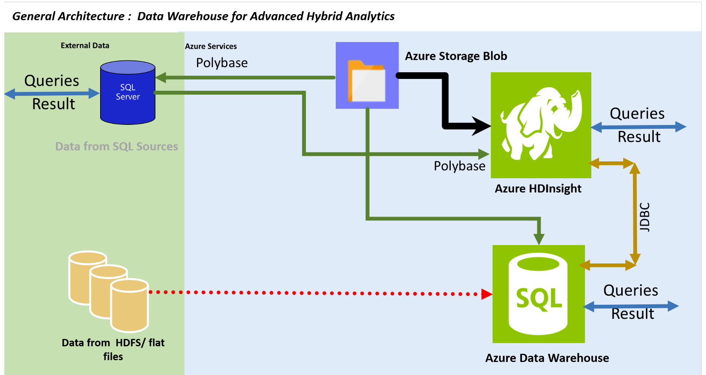

<properties
	pageTitle="Data Warehouse for Advanced Hybrid Analytics | Microsoft Azure"
	description="Data Warehouse for Advanced Hybrid Analytics."
	keywords="hdi, azure sql data warehouse, sql server 2016, polybase, jdbc, sparksql"
	services="sql-data-warehouse,sql-database,hdinsight,polybase,hadoop"
	documentationCenter=""
	authors="emawa"
	manager="roalexan"
	editor=""/>

<tags
	ms.service="sql-data-warehouse"
	ms.workload="data-services"
	ms.tgt_pltfrm="na"
	ms.devlang="na"
	ms.topic="article"
	ms.date="08/23/2016"
	ms.author="emawa" />

# Data Warehouse for Advanced Hybrid Analytics  
Fast growing companies rely on data to make decisions that advance profitability. Lots of companies have data that reside both on premises and in cloud. Our observation 
is that most want to leverage the cloud for possible data congregation routes but lack
how best to achieve this using Azure products.  

A few possible scenarios are:

- Run ETL (Extract, Transform, Load) activities on SQL-like systems in 
cloud, or a mixture of SQL and HDInsight. 
- The user may want to be closest to the largest source of data (locality of reference). 
- The user may want to keep using SQL and not want to go to SQL DW because it will take a long time to replicate the efficiency, latency and network I/O

## USES CASES
1. Client applications may depend heavily on the On-Premises SQL data sources. However business cases and needs always arise, like data replication and/or scalability, while still guaranteeing business uptime. A strategic approach to gradually migrate data to the cloud can be achieved using PolyBase running On-Premises SQL sources to Azure Storage Blob.  

1. Clients may want to merge and update unstructured/semi-structured data that changes all the time with relational data. ETL is possible but handling the relational part 
maybe challenging. The user can perform the transformation on HDI, project, merge and then update relational data stores.
1. ETL on relational data can be challenging. There may be situations where ETL is not easily transformed to TSQL and/or USQL. We can reuse all that in HDI without having to allocate a fresh resource. 

## TABLE OF Contents

1. [Scope of Tutorial ](#scope)
2. [Prerequisites](#prerequisites)
3. [Resource Deployment Walkthrough](#resource-deployment-walkthrough)
4. [Integrating data from Azure Blob with SQL-Like Systems via Polybase](#integrating-data-from-azure-blob-with-sql-via-polybase)
5. [Integrating data from SQL sources with HDInsight via SparkSQL](#integrating-data-from-sql-sources-with-hdinsight-using-sparksql)
6. [Integrating data from On-Premises Hadoop with HDInsight](#integrating-data-from-on-premises-hadoop-with-hdinsight)
7. [Migrating data from On-Premises SQL sources to HDInsight external tables using PolyBase and Azure Blob](#migrating-sql-data-to-hdi-using-polybase-and-blob)

## Scope
This tutorial helps you create an end-to-end (E2E) deployment ready pipeline for showing
Azure data warehousing capabilities using SQL Data Sources and HDInsight.  

The tutorial will describe the overall approach through the following steps:  

1. ARM deployment of Azure Resources.  

1. Creating and loading of sample datasets on On-Prem SQL Server 2016,  SQL Data Warehouse and HDI.

1. Running SQL-like transactions on On-Prem SQL Server 2016, SQL Data Warehouse and  Spark-Shell using SparkSQL.

### Architecture Overview


## Prerequisites

This guide assumes the following prerequisites -  

1. An Active [Azure](https://azure.microsoft.com/) subscription.

1. Access to the latest [Azure PowerShell](http://aka.ms/webpi-azps) to run (CLI) commands 

1. A container under the newly created Storage Account with Read/Write access; storage for the following external sources.  
	- Additional rows of the **FactInternetSales** sample data from the **AdventureWorks** datasets.
	- Sample data created to demonstrate PolyBase capabilities.


## Resource Deployment Walkthrough
To get started, choose a deployment method below. Either deploy the Azure resources by clicking the `Deploy to Azure` or follow the `step-by-step` guide (more detailed). Both achieves the same goal.  

### One Button Deploy
Clicking button below creates a new `blade` in Azure portal.

<a target="_blank" id="deploy-to-azure" href="https://portal.azure.com/#create/Microsoft.Template/uri/https%3A%2F%2Fbostondata.blob.core.windows.net%2Fedw-data-virtualization%2Fazuredeploy.json"></a>

This will create a new "blade" in the Azure portal.

### Step by Step guide with PowerShell

1. Open up PowerShell.

1. Log into your Azure Account and add your subscription:  

    `Login-AzureRmAccount` 

    Enter your login details in the pop-up window.

1. Create a new Azure Resource Group to  logical grouping for your resources:  

    `New-AzureRmResourceGroup -Name your_group_name -Location "East US 2"`  

1. Deploy and initialize Azure Resources:  
    
    ` New-AzureRmResourceGroupDeployment -Name your_deployment_label -ResourceGroupName your_group_name -TemplateFile azuredeploy.json [-Verbose]`

    **_The optional **-Verbose** flag displays deployment process on standard output._**  
	
	This deployment script will deploy the following resources:  
    
    - Azure Storage Account (_mapped file system for the HDI Cluster_)
    - Azure SQL Logical Server (_to host the DB/DW_)
    - Azure SQL Database  
    - Azure SQL Data Warehouse
    - Firewall rules for the SQL Server
    - Azure Spark HDInsight cluster  
	- SQL Server 2016 VM with PolyBase pre-installed and loaded with sample data.

At this point, you have added your subscription, created a new resource group, HDI Spark (2 head, 2 worker) cluster, storage account
(mapped to HDI cluster as default filesystem), a SQL Data Warehouse with Polybase support, a Virtual Machine configured with SQL Server 2016 running PolyBase and sample db and table attached to the DW and SQL Server.  


>### Important Notes
>Please make note of the following key points:
>
>1. **Data Source:** This tutorial uses the **FactInternetSale** table from the **AdventureWorks** Data for exercises interacting with SQL DW and given sample data for exercises demonstrated on On-Prem SQL Server 2016. _Instructions to load all data described below_.  
>  
>1. **Polybase support/activities:** There is no Polybase support (at the time of writing this) 
>for Azure SQL Database and SQL Servers prior to 2016.  
Due to this we have deployed the On-Prem SQL Server 2016 on a VM, preinstalled with PolyBase. If for any reason, the PolyBase Data Movement and Engine services do not start automatically, uninstall and reinstall PolyBase as an added feature to SQL Server. SQL Server 2016 installation ISO is stored on `C:\TUTORIAL_EXTRAS_OPEN_ME\SQLServer_13.0_Full`
>
> No different actions or commands are needed to achieve the same effect on PolyBase running on On-Premises SQL Server **2016** and  on Azure SQL Datawarehouse. 
>	- Go to [PolyBase installation](https://msdn.microsoft.com/en-us/library/mt652312.aspx) for instructions on getting Polybase onto SQL Server **2016**. 


## Integrating data from Azure Blob with SQL via Polybase 

### Create and Migrate sample data to Azure Blob Storage 
We need an external storage in blob for PolyBase to link to and create external tables  in SQL Data Warehouse.

#### Create a new container under storage account.
Create a new blob storage container under the newly deployed Storage Account to save some extra sample data. Make note of newly created container.  

  > **Azure Blob container creation Tools -** [Azure portal](https://portal.azure.com/signin/index/?cdnIndex=4&l=en.en-us) or [Azure Storage Explorer](http://storageexplorer.com/)  

#### Create Sample data  
Create and save some sample data locally  (`sampledata.csv`).  

```
0.0000,100.0000,'1) 0 - 100'
100.0001,500.0000,'2) >100 - 500'
500.0001,1000.0000,'3) >500 - 1000'
1000.0001,2000.0000,'4) >1000 - 2000'
2000.0001,5000.0000,'5) >2000 - 5000'
5000.0001,10000.0000,'6) >5000 - 10000'
10000.0001,20000.0000,'7) >10000 - 20000'
20000.0001,30000.0000,'8) >20000 - 30000'
30000.0001,40000.0000,'9) >30000 - 40000'
40000.0001,50000.0000,'10) >40000 - 50000'
50000.0001,60000.0000,'11) >50000 - 60000'
60000.0001,70000.0000,'12) >50000 - 70000'
70000.0001,80000.0000,'13) >50000 - 80000'
80000.0001,90000.0000,'14) >50000 - 90000'
90000.0001,100000.0000,'15) >50000 - 100000'
100000.0001,99999999999999.9999,'16) >100000'
```

Copy the sample data from your local machine data to Azure Storage blob using [AzCopy tool](https://azure.microsoft.com/en-us/documentation/articles/storage-use-azcopy/).  

```
AzCopy /Source:<Sample Data Location>  /Dest:https://<storage account>.blob.core.windows.net/<container name> /DestKey:<storage key> /Pattern:sampledata.csv
```

###  Create external T-SQL object  
Polybase can create objects that depend on either Hadoop or Azure Blob. For the purposes of this tutorial, we will be creating our external data source that depends on the latter.
Connect to the earlier created database on SQL DW and following instructions below.  

**LINKS**  - Interact with SQL DW via [Visual Studio](https://www.visualstudio.com/) or [Microsoft SQL Server Management Studio](https://msdn.microsoft.com/en-us/library/mt238290.aspx).  

- Create a master key on the database.  
This step is very important to encrypt the credential secret during network I/O transmission.

```
CREATE MASTER KEY ENCRYPTION BY PASSWORD = 'Us3@M0reS3cur3dP@ssw0rd!';
```

- Use master key to create a database scoped credential for our Azure blob storage.  
*Parameters:*  
    - **IDENTITY:** Any string identifier (not used for authentication). *Preferrably use your storage name*.  
    - **SECRET:** Your Azure storage account key (can be found on [Azure Portal](portal.azure.com))

```
CREATE DATABASE SCOPED CREDENTIAL AzureStorageCredential
WITH IDENTITY = '<your_storage_name>', Secret = '<storage_account_access_key>';
```

- Create your external data source. 

*Parameters:* 
    - **LOCATION:**  Wasb path to Azure account storage account and blob container.  
    - **CREDENTIAL:** The database scoped credential we created earlier. 

```
CREATE EXTERNAL DATA SOURCE AzureStorage WITH (
	TYPE = HADOOP,
	LOCATION = 'wasbs://<blob_container_name>@<azure_storage_account_name>.blob.core.windows.net',
	CREDENTIAL = AzureStorageCredential	
);
```

- Create an file format for external source.  
In Polybase this is important to describe the format/structure of the input data.  
*Parameters:*  
    - **FORMAT TYPE:** Data format in Azure Blob. *Examples DELIMITEDTEXT,  RCFILE, ORC, PARQUET.*   

```
CREATE EXTERNAL FILE FORMAT TextFileFormat WITH (
	FORMAT_TYPE = DELIMITEDTEXT,
	FORMAT_OPTIONS (FIELD_TERMINATOR = ',', USE_TYPE_DEFAULT = TRUE)
);
```

- Create an external table and define table schema to hold sample data.  
We are now ready to create our external table that points to an external storage.  
*Parameters:*  
    - **LOCATION:** Path to a file or directory that contains the actual data (this is relative to the blob container described earlier).    
        - To point to all files under the blob container, use **LOCATION='/'**  

```
CREATE EXTERNAL TABLE TRANSACTIONS_EXTERNAL (
	TRANSACTION_MIN DECIMAL(18,4),
	TRANSACTION_MAX DECIMAL(18,4),
	TRANSACTION_DESC VARCHAR(255)
)
WITH (LOCATION='/',
	  DATA_SOURCE = AzureStorage,
	  FILE_FORMAT = TextFileFormat
);
```

### Create local T-SQL object  
Create a sample table on the local SQL Server database, which will be used for ad-hoc queries against the external table.  

- Create an internal/local table and define table schema.  

```
CREATE TABLE TRANSACTIONS_INTERNAL (
	TRANSACTION_MIN DECIMAL(18,4),
	TRANSACTION_MAX DECIMAL(18,4),
	TRANSACTION_DESC VARCHAR(255)
);
```

- Insert sample data to internal table.  

```
INSERT INTO TRANSACTIONS_INTERNAL VALUES (0.0000, 100.0000, '1) 0 - 100');
INSERT INTO TRANSACTIONS_INTERNAL VALUES (100.0001, 500.0000, '2) >100 - 500');
INSERT INTO TRANSACTIONS_INTERNAL VALUES (500.0001, 1000.0000, '3) >500 - 1000');
INSERT INTO TRANSACTIONS_INTERNAL VALUES (1000.0001, 2000.0000, '4) >1000 - 2000');
INSERT INTO TRANSACTIONS_INTERNAL VALUES (2000.0001, 5000.0000, '5) >2000 - 5000');
INSERT INTO TRANSACTIONS_INTERNAL VALUES (5000.0001, 10000.0000, '6) >5000 - 10000');
INSERT INTO TRANSACTIONS_INTERNAL VALUES (10000.0001, 20000.0000, '7) >10000 - 20000');
INSERT INTO TRANSACTIONS_INTERNAL VALUES (20000.0001, 30000.0000, '8) >20000 - 30000');
INSERT INTO TRANSACTIONS_INTERNAL VALUES (30000.0001, 40000.0000, '9) >30000 - 40000');
INSERT INTO TRANSACTIONS_INTERNAL VALUES (40000.0001, 50000.0000, '10) >40000 - 50000');
INSERT INTO TRANSACTIONS_INTERNAL VALUES (50000.0001, 60000.0000, '11) >50000 - 60000');
INSERT INTO TRANSACTIONS_INTERNAL VALUES (60000.0001, 70000.0000, '12) >50000 - 70000');
INSERT INTO TRANSACTIONS_INTERNAL VALUES (70000.0001, 80000.0000, '13) >50000 - 80000');
INSERT INTO TRANSACTIONS_INTERNAL VALUES (80000.0001, 90000.0000, '14) >50000 - 90000');
INSERT INTO TRANSACTIONS_INTERNAL VALUES (90000.0001, 100000.0000, '15) >50000 - 100000');
INSERT INTO TRANSACTIONS_INTERNAL VALUES (100000.0001, 99999999999999.9999, '16) >100000');
```

### Demonstrating ad-hoc queries.
Both external and internal tables are exposed to the SQL compute engine, and we can query both irregardless of their locations.  

```
SELECT * FROM TRANSACTIONS_INTERNAL AS A inner join TRANSACTIONS_EXTERNAL as B on A.TRANSACTION_MAX = B.TRANSACTION_MAX;
```

```
SELECT * FROM TRANSACTIONS_INTERNAL AS A right join TRANSACTIONS_EXTERNAL as B on A.TRANSACTION_MAX > B.TRANSACTION_MAX;
```


```
SELECT * FROM TRANSACTIONS_INTERNAL AS A full join TRANSACTIONS_EXTERNAL as B on A.TRANSACTION_MAX > B.TRANSACTION_MAX;
```


## Integrating data from SQL sources with HDInsight using SparkSQL  
**SQL interaction example with JDBC**

SQL server Database/Datawarehouse have both storage and compute on the same machine. Apache Spark on HDInsight is a scalable compute engine that connects storage from separate platforms like Azure Blob Storage, HDFS and so on.  

This tutorial demonstrates the capabilities of Spark in leveraging distributed data stores in a hybrid data harmonization mode; integrating data from SQL sources into the Spark ecosystem on HDI.  

### Benefits  

1. A user can issue a query in HDI as HQL or SparkSQL in a situation where there is partial data on HDFS (or similar) and rest on traditional relational sources. A connection is made to SQL Server, retrieve data and compute on HDI.  
1. There is a minimal learning curve; a user can easily transfer SQL knowledge while getting Spark's in-memory computation (100x faster than hadooop Map/Reduce).

### Requirements
1. SQL Server Data Warehouse with sample data. ARM deployment for SQL Data Warehouse doesn't supply the sample data. 
For instructions on how to manually load sample data into Data Warehouse, click [here!](https://azure.microsoft.com/en-us/documentation/articles/sql-data-warehouse-load-sample-databases/)

**NOTE** : On HDInsight, SQL Server JDBC jar is bundled by default during deployment (Linux - **/usr/hdp/2.2.7.1-10/hive/lib/sqljdbc4.jar**). For futher information on how to configure Spark to access Microsoft SQL Server check here 
[How to allow Spark access Microsoft SQL Server](https://blogs.msdn.microsoft.com/bigdatasupport/2015/10/22/how-to-allow-spark-to-access-microsoft-sql-server/) 


### Create Hive Data Store, Connect SQL Datawarehouse from Spark 
Let us begin by first connecting to our DW table. From the Spark shell, we are going to create a connection to the SQL Datawarehouse table and then 
run some sample queries using SparkSQL.

#### 1. Create an external table on Hive Metastore using HQL. 
This tutorial uses the **FactInternetSale** Sample table.

  **NOTE:** It is possible to create the Hive table directly from Spark shell, but we want to show a direct interaction with Hive via Web UI.  

- Launch Ambari views from portal  
From [Azure Portal](portal.azure.com), go to the newly created HDInsight cluster. Click on **Ambari Views** to connect via http. Enter your username and password 
set during ARM deployment.  

  - Create Database and external table pointing to data on Azure Storage. 

  > **IMPORTANT**  
  > WASB must be able to find the Azure Storage account key in it's configuration. Using `SET` statement to provide a new secret key will not work. `CREATE TABLE` runs in the metastore service and has not visibility to the `SET` statements. Hence no runtime configuration changes will be used. 
  >
  > **Remedy -** Create extra containers in the Storage Account attached to the HDI Cluster and save any extra data. Easily achieve this using [Azure portal](https://portal.azure.com/signin/index/?cdnIndex=4&l=en.en-us) or [Azure Storage Explorer](http://storageexplorer.com/),

```
CREATE DATABASE IF NOT EXISTS DATAANALYTICS;
CREATE EXTERNAL TABLE DATAANALYTICS.FactInternetSales
(
	ProductKey int,
	OrderDateKey int,
	DueDateKey int,
	ShipDateKey int,
	CustomerKey int,
	PromotionKey int,
	CurrencyKey int,
	SalesTerritoryKey int,
	SalesOrderNumber string,
	SalesOrderLineNumber tinyint,
	RevisionNumber tinyint,
	OrderQuantity smallint,
	UnitPrice decimal(18, 6),
	ExtendedAmount decimal(18, 6),
	UnitPriceDiscountPct float,
	DiscountAmount float,
	ProductStandardCost decimal(18, 6),
	TotalProductCost decimal(18, 6),
	SalesAmount decimal(18, 6),
	TaxAmt decimal(18, 6),
	Freight decimal(18, 6),
	CarrierTrackingNumber string,
	CustomerPONumber string
)
ROW FORMAT DELIMITED FIELDS TERMINATED BY ',' 
LINES TERMINATED BY '\n'
STORED AS TEXTFILE LOCATION 'wasb://<container_name>@<storage_account_name>.blob.core.windows.net/'
tblproperties ("skip.header.line.count"="1");
```

#### 2. Start the spark shell pointing to the JDBC connector.  
With the JDBC defined variables, connect and load data from the SQL DW table.  

  **NOTE:** All JDBC jar files are available on HDI Clusters by default at **/usr/hdp/<version_of_hdp_number>/hive/lib/**  

```
$SPARK_HOME/bin/spark-shell --jars  /usr/hdp/2.4.2.0-258/hive/lib/sqljdbc4.jar
```

If Spark shell loads successfully, we can now connect to the SQL DW Table **FactInternetSale** and read the table.  
The following Scala code defines connection variables to an Azure SQL Data Warehouse table and connects to the external table; making it available for querying.    

```
scala> val url = "jdbc:sqlserver://<mysqllogicalserver>.database.windows.net:1433;database=<db_name>;user=<user_name>@<my_sqllogical_server_name>;password=<your_password>"  
```

```
scala> val driver = "com.microsoft.sqlserver.jdbc.SQLServerDriver"  
```

```
scala> val table = "FactInternetSales"
```

**NOTE**  
Since our exercise implements a hybrid query harmonization between SQL DW and Hive, we will use the hiveContext. This will give us the SparkSQL commands and also Hive functionalities that will 
let use perform joins. We need to do this because temporary tables are registered in-memory and attached to a specific SQLContext.

#### 3. Construct a HiveContext (with SQL implicit commands) and fetch data from SQL DW.

- Import HiveContext package

```
scala> import org.apache.spark.sql.hive.HiveContext

```

- Construct a HiveContext and attach to existing Spark context.  

  In order to work with Hive from Spark, you must construct a HiveContext.  

  **NOTE** -  HiveContext inherits from SQLContext and also benefits from all SQL commands available from SQLContext. It is still possible to create a HiveContext without a Hive deployment. For details visit [Spark SQL Docs](http://spark.apache.org/docs/latest/sql-programming-guide.html)  

```
scala> val hiveContext = new org.apache.spark.sql.hive.HiveContext(sc)
```

```
scala> import hiveContext.implicits._
```

- Fetch data from SQL Data Warehouse

```
scala> val dw_factInternetSales = hiveContext.read.format("jdbc").option("url", url).option("driver", driver).option("dbtable", table).load()
```

To confirm a success connection, we should get a description of the columns of the table **FactInternetSales** as a **dataframe** `df`  

> df: org.apache.spark.sql.DataFrame = [ProductKey: int, OrderDateKey: int, DueDateKey: int, ShipDateKey: int, CustomerKey: int, PromotionKey: int, CurrencyKey: int, SalesTerritoryKey: int, SalesOrderNumber: string, SalesOrderLineNumber: int, RevisionNumber: int, OrderQuantity: int, UnitPrice: decimal(19,4), ExtendedAmount: decimal(19,4), UnitPriceDiscountPct: double, DiscountAmount: double, ProductStandardCost: decimal(19,4), TotalProductCost: decimal(19,4), SalesAmount: decimal(19,4), TaxAmt: decimal(19,4), Freight: decimal(19,4), CarrierTrackingNumber: string, CustomerPONumber: string]

You can view the data in `df_factinternetsales` by a call to action `df.show`. This will display the **top 20 rows** by fetching results from the executors back to the driver node.

```
scala> dw_factInternetSales.show
```

To view the dataframe schema.  

```
scala> dw_factInternetSales.printSchema
```

You should a similar output as the following:  

>root  
 |-- ProductKey: integer (nullable = false)   
 |-- OrderDateKey: integer (nullable = false)  
 |-- DueDateKey: integer (nullable = false)  
 |-- ShipDateKey: integer (nullable = false)  
 |-- CustomerKey: integer (nullable = false)  
 |-- PromotionKey: integer (nullable = false)  
 |-- CurrencyKey: integer (nullable = false)  
 |-- SalesTerritoryKey: integer (nullable = false)  
 |-- SalesOrderNumber: string (nullable = false)  
 |-- SalesOrderLineNumber: integer (nullable = false)  
 |-- RevisionNumber: integer (nullable = false)  
 |-- OrderQuantity: integer (nullable = false)  
 |-- UnitPrice: decimal(19,4) (nullable = false)  
 |-- ExtendedAmount: decimal(19,4) (nullable = false)  
 |-- UnitPriceDiscountPct: double (nullable = false)  
 |-- DiscountAmount: double (nullable = false)  
 |-- ProductStandardCost: decimal(19,4) (nullable = false)  
 |-- TotalProductCost: decimal(19,4) (nullable = false)  
 |-- SalesAmount: decimal(19,4) (nullable = false)  
 |-- TaxAmt: decimal(19,4) (nullable = false)  
 |-- Freight: decimal(19,4) (nullable = false)  
 |-- CarrierTrackingNumber: string (nullable = true)  
 |-- CustomerPONumber: string (nullable = true)  


Now we will register our dataframe as a table in our SQLContext i.e. making it queriable like another relational table  
```
scala> dw_factInternetSales.registerTempTable("DW_FactInternetSales")
```

We now have a queriable SQL Data Warehouse table from a Spark SQLContextSQL. Table is registered as a temporary table and has all SQL commands available to SQLContext.  
To verify the data, a quick select will show this.  

```
scala>  hiveContext.sql("SELECT * FROM DW_FactInternetSales LIMIT 10").show
```

Next we want to point to the external table on Hive Metastore we created earlier. 

- Fetch Hive Data from Spark via our HiveContext  

Spark gets Hive for free using the HiveContext. To work with Hive, we must create a HiveContex. It is very easy to retrieve data stored on a metastore directly from SparkContext.  

```
scala> val hv_FactInternetSales = hiveContext.sql("SELECT * FROM DATAANALYTICS.FactInternetSales")
```

```
scala> hv_FactInternetSales.registerTempTable("HV_FactInternetSales")
```

### Perform Ad-hoc query between SQL DW Table and Hive external table  
At this point, we have our SQL DW and Hive tables registered in-memory on the Spark executors. Using the HiveContext to
perform ad-hoc queries like JOINS becomes trivial.

- Join tables

```
scala> val results = hiveContext.sql("SELECT * FROM HV_FactInternetSales AS A LEFT JOIN DW_FactInternetSales AS B ON A.productkey = B.productkey LIMIT 10")
```

`results` is a dataframe (formerly SchemaRDD) that we can view, manipulate and export. 

- View output result. 

```
scala> results.show
```


  

## Integrating data from On Premises Hadoop with HDInsight
#### **USE CASE:**   
- INTEGRATING SEMI-STRUCTURED DATA WITH RELATIONAL DATA. 

Curerntly, integrating data residing on On-Prem Hadoop with Azure compute platforms, like HDInsight, is not a trivial process. In order to get better end-to-end throughput an intermediate copy to blob would be needed. One would need to use PolyBase and StagedCopy (using **Azure Data Factory**). Azure Data Factory is able to apply transformations that match PolyBase/SQL source requirements. Check out [Staged Copy using PolyBase](https://azure.microsoft.com/en-us/documentation/articles/data-factory-azure-sql-data-warehouse-connector/#staged-copy-using-polybase) for further details.  

This workflow, although offers a way to virtualize data on-prem and in cloud, focuses more on data copy and not integration nor harmonization. This can easily get expensive in terms of resources (for staged copy), security concerns (additional step to encrypt) and so on.   

Our tutorial tries to focus on harmonization processes and routes, hence we will achieve the update and merge using Hadoop sources in Azure.  

We will be using the **FactInternetSale** table from the **AdventureWorks** Dataset.

**Columns -** `ProductKey, OrderDateKey, DueDateKey, ShipDateKey, CustomerKey, PromotionKey, CurrencyKey, SalesTerritoryKey, SalesOrderNumber, SalesOrderLineNumber, RevisionNumber, OrderQuantity, UnitPrice, ExtendedAmount, UnitPriceDiscountPct, DiscountAmount, ProductStandardCost, TotalProductCost, SalesAmount, TaxAmt, Freight, CarrierTrackingNumber, CustomerPONumber
`


## Migrating SQL data to HDI using PolyBase and Blob
#### **USE CASE**  
- MIGRATORY ROUTE FROM ON-PREMISES SQL SOURCES TO HDINSIGHT USING POLYBASE AND AZURE BLOB.  

With the growth of data, clients will require a more robust workflow for ETL jobs. The option of migrating big data to cloud for this task is becomging very useful. Needless to say, applications that are dependent on on-prem infrastructure would need to still be supported, while the ETL is run in cloud. This use case covers a pattern of projecting data, using Polybase, to HDInsight clusters targetting external tables that are backed by Azure Blob.   

#### Prerequisites  
The following PolyBase T-SQL objects are required. 

1. Database scoped credential 

1. External Data source  

1. External file format  

1. Blank external table on Azure Blob  


Earlier, in [Integrating data from Azure Blob with SQL-Like Systems via Polybase](#integrating-data-from-azure-blob-with-sql-via-polybase), we created objects that can be reused; database scoped credential, data source, and file format. We will need to create a new external table to hold data projected.  

>For detailed information on [Creating PolyBase T-SQL objects](https://msdn.microsoft.com/en-us/library/mt652315.aspx).

**Tables to migrate**  
1. Product table from AdventureWorks2012.

**Essential House keeping**  
> From SSMS, you may encounter the following error message while trying to export your tables. 
>
>  
>`Queries that reference external tables are not supported by the legacy cardinality estimation framework. Ensure that trace flag 9481 is not enabled, the database compatibility level is at least 120 and the legacy cardinality estimator is not explicitly enabled through a database scoped configuration setting.`  
>
> The following configurations must be set correctly. 
> 1. PolyBase must be allowed to export external tables.
> 1. The legacy compability estimation must be turned off.  
> 1. Your database compability level must be at least 120.


- Allow PolyBase to export external tables  
```
sp_configure 'allow polybase export', 1;
RECONFIGURE;
```

- Confirm legacy compability estimation is turned off.  
```
SELECT  name, value  
    FROM  sys.database_scoped_configurations  
    WHERE name = 'LEGACY_CARDINALITY_ESTIMATION';  
```

If set correctly, you would see  

  

- Check database compatibility level and alter to at least 120 if needed.  

Display all database levels
```
SELECT    d.name, d.compatibility_level  
    FROM  sys.databases AS d;
```

Alter level if needed, for my case I chose 130.

```
SELECT ServerProperty('ProductVersion');  
go  
  
ALTER DATABASE your_database_name  
    SET COMPATIBILITY_LEVEL = 130;  
go  
  
SELECT    d.name, d.compatibility_level  
    FROM  sys.databases AS d  
    WHERE d.name = 'your_database_name';  
go  

```

Outputs  

| name          | compability_level
| ------------- |:-------------:| 
| `your_database_name`| 130 | 
  


#### Create an external table and define table schema to hold data.

> **Important Note**  
The external table's schema definitions must match the schema of table we are trying to project. Decompose defined data types, like `FinishedGoodsFlag`, into its underlying data type `BIT`. 


##### Expand the `Columns` folder in SQL Server Management Studio (SSMS) to examine.   

  


##### Point External table to Blob container

 > **IMPORTANT**  
  > WASB must be able to find the Azure Storage account key in it's configuration. Using `SET` statement to provide a new secret key will not work. `CREATE TABLE` runs in the metastore service and has not visibility to the `SET` statements. Hence no runtime configuration changes will be used. 
  >
  > **Remedy -** Create extra containers in the Storage Account attached to the HDI Cluster and save any extra data. Easily achieve this using [Azure portal](https://portal.azure.com/signin/index/?cdnIndex=4&l=en.en-us) or [Azure Storage Explorer](http://storageexplorer.com/),


```
CREATE EXTERNAL TABLE Product(
	ProductID INT,
	Name NVARCHAR(50),
	ProductNumber nvarchar(25),
	MakeFlag BIT,
	FinishedGoodsFlag BIT,
	Color NVARCHAR(15),
	SafetyStockLevel smallint,
	ReorderPoint smallint,
	StandardCost money,
	ListPrice money,
	Size NVARCHAR(5) ,
	SizeUnitMeasureCode NCHAR(3) ,
	WeightUnitMeasureCode NCHAR(3),
	Weight decimal(8, 2),
	DaysToManufacture int,
	ProductLine NCHAR(2),
	Class NCHAR(2),
	Style NCHAR(2),
	ProductSubcategoryID int,
	ProductModelID int,
	SellStartDate datetime,
	SellEndDate datetime ,
	DiscontinuedDate datetime,
	rowguid NVARCHAR (255),
	ModifiedDate datetime
)
WITH (LOCATION='/product',
	  DATA_SOURCE = AzureStorage,
	  FILE_FORMAT = TextFileFormat
);
```

*Parameters:*  
1. **LOCATION:** Path to a file or directory that contains the actual data (this is relative to the blob container described earlier).  
	- To point to all files under the blob container, use **LOCATION='/'**  

##### Project and export data  
Move on-prem data to Azure blob using Polybase.  
`INSERT INTO dbo.Product SELECT * FROM AdventureWorks2012.Production.Product;`  

At this point, our data is exported sucessfully Azure Storage. It is easily accessible from HDI, for instance, using Hive or Spark query languages. Update and Merge can easily be achieved where HDI outputs to blob or other destinations.

##### Integrate exported data back to HDI  (Hive example) 
The exported data can now be loaded back to HDI for ETL, Update or Merge tasks.

```
CREATE DATABASE IF NOT EXISTS DATAANALYTICS;
CREATE EXTERNAL TABLE DATAANALYTICS.Product(
	ProductID INT,
	Name string,
	ProductNumber string,
	MakeFlag int,
	FinishedGoodsFlag int,
	Color string,
	SafetyStockLevel smallint,
	ReorderPoint smallint,
	StandardCost decimal(18, 2),
	ListPrice decimal(18, 2),
	Size string,
	SizeUnitMeasureCode string,
	WeightUnitMeasureCode string,
	Weight decimal(8, 2),
	DaysToManufacture int,
	ProductLine string,
	Class string,
	Style string,
	ProductSubcategoryID int,
	ProductModelID int,
	SellStartDate timestamp,
	SellEndDate timestamp ,
	DiscontinuedDate timestamp,
	rowguid string,
	ModifiedDate timestamp
)
ROW FORMAT DELIMITED FIELDS TERMINATED BY ',' 
LINES TERMINATED BY '\n'
STORED AS TEXTFILE LOCATION 'wasb://<container_name>@<storage_account_name>.blob.core.windows.net/product';
```  

See example above for an example where data residing on blob was integrated with SQL Datawarehouse. ([Integrating data from SQL sources with HDInsight via SparkSQL](#integrating-data-from-sql-sources-with-hdinsight-using-sparksql))  


