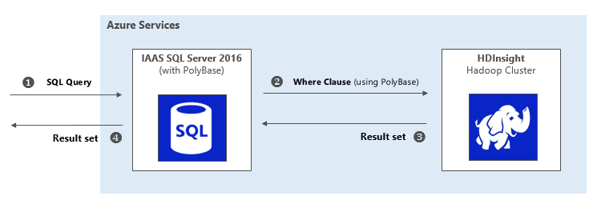

# Summary

This tutorial demonstrates two data virtualization techniques, namely, Query Scale-out and Hybrid Execution.

Approximate provisioning time: 30 minutes

# Overview

In this demo you will deploy and run two flavors of data virtualization on the Azure stack.

The first section of the demo implements Query Scale-out, which demonstrates how computation speed scales up when a SQL query from an SQL Server 2016 is executed on an HDInsight cluster (using PolyBase technology).

The second section deploys Hybrid execution technique and demonstrates how to join your relational data in an Azure SQL Data Warehouse with data residing in a Hadoop cluster.

To run this demo, you need an active Azure subscription. The demo uses the following Azure services:

1.	HDInsight (HDI)
1.  SQL Server 2016 (IaaS) with PolyBase
1.  Azure SQL Data Warehouse (SQL DW)  
1.  Azure Storage Blob

This automated deployment installs Java Runtime Environment (JRE) for you. The user of this tutorial is willing to agree to the [terms of the Oracle JRE][1]. If you disagree with JRE terms of use, please do not proceed with rest of this document.

# Description

Machine and deep learning rely heavily on large data sets - both historical data and data across business functions (sales, marketing, human resources etc.).

To gain advanced insights from data, we need techniques to access big data stored in various heterogenous systems without having to move the data physically.

Also, in big data platforms as the demand for crunching data increases, we run into resource constrained environments. That’s when the ability to offload compute to powerful processing clusters becomes critical.

This demo shows how data virtualization addresses the above use cases, using Query Scale-out and Hybrid Execution techniques.

In the case of Query Scale-out, a part of an entire query is executed remotely (without the user necessarily being aware) on a faster, higher capacity big data system.

Query Scale-Out can be illustrated abstractly as:

Hybrid Execution “pushes” the query to a remote system. This enables access to referential relational data from a non-relational system such as Hadoop.

Hybrid Execution can be illustrated abstractly as:

![Hybrid Execution][IMG2]

The benefits of data virtualization can be summarized as follows:

•	 Offload large computation to more powerful processing systems and seamlessly merge the results.

•	Access large collections of disparate data sources across system boundaries (example: distinct systems for marketing and sales data).

•	Enable queries against large datasets without the need to move them to a single system (potentially with limited storage).

•	Reduce heavy network I/O by moving compute to the data.

•	Simplify access to all sorts of data using a single query language (example: SQL).

•	Avoid the need to replicate business logic across multiple systems.

•	Integrate cloud-based compute with corporate datacenter environments.

To start the deployment, click on the deployment button.

For a deeper understanding on how to implement the data virtualization techniques, read the [technical guide][2].

[IMG1]: ./assets/media2/queryscaleoutazure.png
[IMG2]: ./assets/media2/hybridexecutionazure.png
[1]: http://www.oracle.com/technetwork/java/javase/terms/license/index.html
[2]: https://github.com/Azure/cortana-intelligence-dw-advanced-hybrid-analytics/blob/master/README.md
